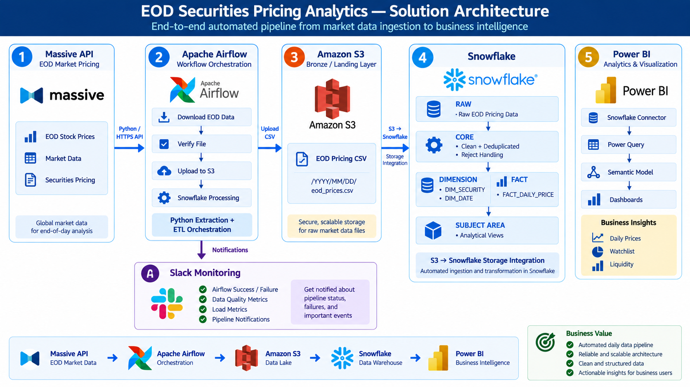
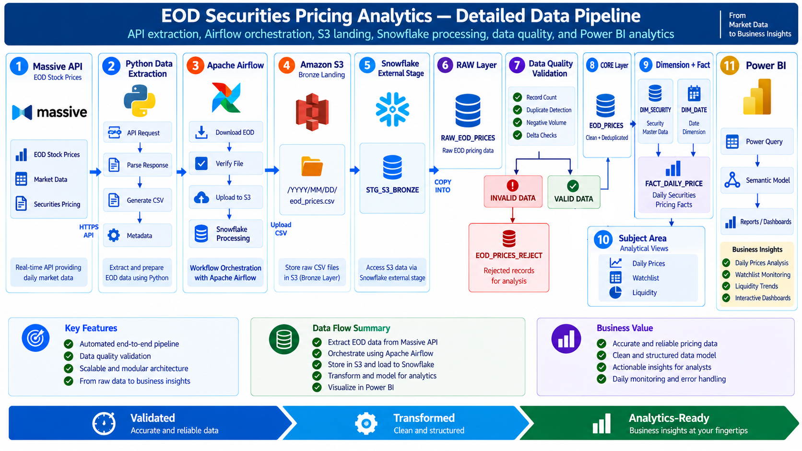
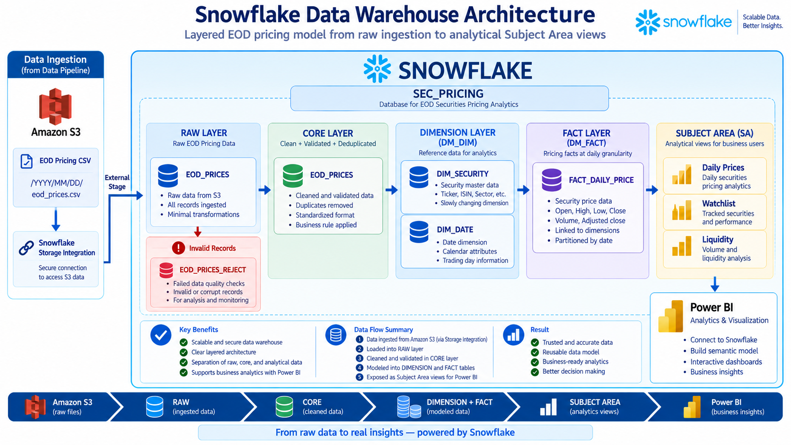
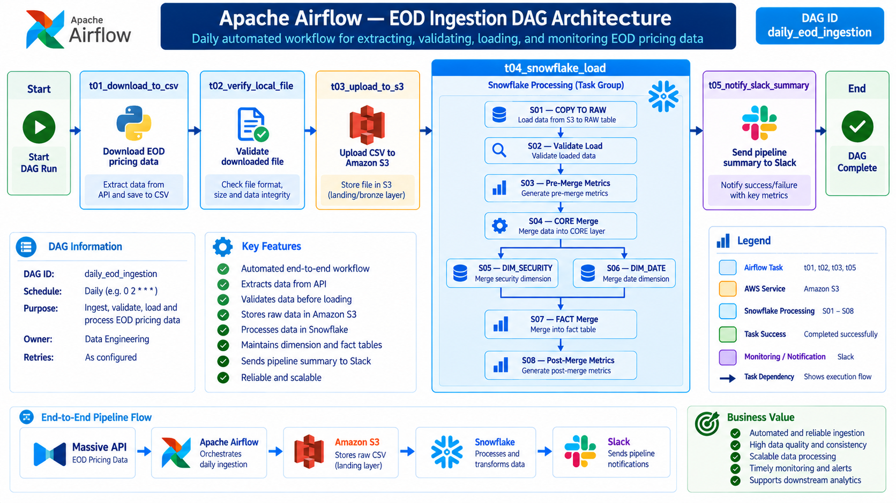
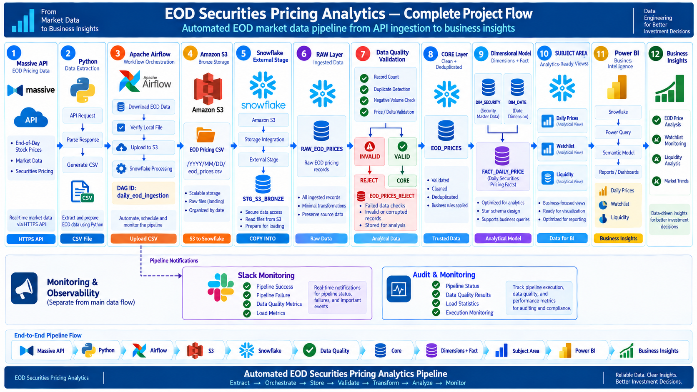

# 🚀 EOD Securities Pricing Analytics Platform

### End-to-End Market Data Engineering Pipeline using Massive API, Apache Airflow, Amazon S3, Snowflake & Power BI


---

> End-to-End Data Engineering project implementing an automated EOD securities pricing pipeline using Massive API, Python, Apache Airflow, Amazon S3, Snowflake, SQL, Slack, and Power BI.

---

## 📌 Overview

The **EOD Securities Pricing Analytics Platform** is an end-to-end cloud data engineering solution designed to automate the ingestion, validation, transformation, modeling, and analysis of end-of-day securities pricing data.

The platform retrieves market pricing data from the **Massive API**, extracts and prepares the data using **Python**, orchestrates the pipeline using **Apache Airflow**, stores raw EOD pricing files in **Amazon S3**, processes and models the data in **Snowflake**, and delivers analytics-ready Subject Area views to **Power BI**.

The solution follows a layered data warehouse architecture:

```text
Massive API
     ↓
Python Extraction
     ↓
Apache Airflow
     ↓
Amazon S3
     ↓
Snowflake RAW
     ↓
Snowflake CORE
     ↓
DIMENSION + FACT
     ↓
SUBJECT AREA
     ↓
Power BI
```

**Slack** is integrated with Apache Airflow to provide pipeline status, failure notifications, data-quality metrics, and load metrics.

---

# 🏢 Business Background

RBF is a global investment firm that performs daily end-of-day pricing analysis to monitor market activity, liquidity, sector movements, ETF performance, and watchlist securities.

The existing process relied heavily on manual data collection, CSV preparation, validation, and reporting.

As the volume of market data increased, this approach created several challenges:

- Manual collection of EOD market data
- Delayed daily reporting
- Repeated data-processing activities
- Limited data-quality monitoring
- Difficulty tracking liquidity trends
- Increased operational effort
- Lack of centralized historical market data
- Limited visibility into watchlist performance

To address these challenges, the organization required an automated data platform capable of collecting daily market data, validating the information, processing it through a structured warehouse, and delivering business-ready analytics.

---

# 🎯 Business Requirements

The primary objective of this project is to build a scalable and reliable EOD securities pricing data platform that supports daily market analysis and business intelligence.

---

### Automated Market Data Ingestion

Automatically retrieve end-of-day securities pricing data from the Massive API.

The pipeline processes:

- Trade Date
- Security Symbol
- Open Price
- High Price
- Low Price
- Close Price
- Trading Volume

---

### Automated Workflow Orchestration

Automate the complete data pipeline using Apache Airflow.

The workflow should:

- Extract EOD market data
- Generate CSV files
- Validate downloaded files
- Upload files to Amazon S3
- Load data into Snowflake
- Perform data-quality checks
- Merge data into warehouse layers
- Calculate processing metrics
- Send Slack notifications

---

### Centralized Data Warehouse

Build a structured Snowflake data warehouse containing:

- RAW data
- CORE data
- Dimension tables
- Fact tables
- Subject Area analytical views

---

### Data Quality

Implement validation and rejection handling to improve data reliability.

The pipeline should support:

- Record-count validation
- Duplicate detection
- Negative-volume validation
- Valid security/date key validation
- Pre-merge metrics
- Post-merge metrics
- Rejected-record tracking

---

### Business Analytics

Provide Power BI dashboards supporting:

- Daily securities pricing
- Equity trading volume
- Watchlist performance
- Security returns
- Sector liquidity
- ETF liquidity
- Traded value analysis

---

### Monitoring

Provide automated Slack notifications for:

- Pipeline success
- Pipeline failures
- Data-quality metrics
- Load metrics
- Important pipeline events

---

### Scalability

The architecture should support:

- Historical backfill
- Daily incremental processing
- Cloud object storage
- Incremental MERGE processing
- Increasing market-data volumes

---

# 🏗️ Solution Architecture



The platform implements an end-to-end cloud data engineering architecture.

```text
Massive API
     │
     ▼
Python Extraction
     │
     ▼
Apache Airflow
     │
     ▼
Amazon S3
     │
     ▼
Snowflake
     │
     ├── RAW
     │
     ├── CORE
     │
     ├── DIMENSION
     │
     ├── FACT
     │
     └── SUBJECT AREA
     │
     ▼
Power BI
     │
     ▼
Business Insights
```

Slack provides monitoring and notifications from the Airflow pipeline.

---

# ☁️ Cloud Services Used

| Service / Technology | Purpose |
|----------------------|---------|
| Massive API | EOD market data source |
| Python | Data extraction and file generation |
| Apache Airflow | Workflow orchestration |
| Amazon S3 | Bronze / landing storage |
| AWS IAM | Secure AWS access |
| Snowflake | Cloud data warehouse |
| Snowflake Storage Integration | Secure S3 access |
| SQL | Transformation and analytical processing |
| Slack | Monitoring and notifications |
| Power BI | Business intelligence and visualization |
| Docker | Local Airflow environment |
| Git & GitHub | Version control |

---

# 📐 Architecture Components

| Layer | Technology | Purpose |
|-------|------------|---------|
| Source Layer | Massive API | EOD securities pricing |
| Extraction Layer | Python | API extraction and CSV preparation |
| Orchestration Layer | Apache Airflow | Pipeline automation |
| Landing Layer | Amazon S3 | Raw EOD CSV storage |
| External Access Layer | Snowflake Storage Integration | Secure S3 access |
| RAW Layer | Snowflake | Ingested market data |
| CORE Layer | Snowflake | Cleaned and deduplicated data |
| Dimension Layer | Snowflake | Security and date dimensions |
| Fact Layer | Snowflake | Daily pricing facts |
| Subject Area | Snowflake | Analytics-ready views |
| Reporting Layer | Power BI | Business analytics |
| Monitoring Layer | Slack | Pipeline monitoring |

---

# 📂 Repository Structure

```text
securities-pricing-etl-pipeline/
├── airflow/
│   │
│   └── dags/
│       │
│       ├── lib/
│       │   │
│       │   ├── eod_data_downloader.py
│       │   └── slack_utils.py
│       │
│       ├── sql/
│       │   │
│       │   ├── 1. copy_to_raw.sql
│       │   ├── 2. check_loaded.sql
│       │   ├── 3. premerge_metrics.sql
│       │   ├── 4. merge_core.sql
│       │   ├── 5. merge_dim_security.sql
│       │   ├── 6. merge_dim_date.sql
│       │   ├── 7. merge_fact_daily_price.sql
│       │   └── 8. postmerge_metrics.sql
│       │
│       ├── daily_eod_ingestion_dag.py
│       ├── test_aws_s3_connection.py
│       ├── test_slack_connection.py
│       └── test_snowflake_connection.py
│
├── architecture/
│   │
│   ├── 01_solution_architecture.png
│   ├── 02_data_pipeline_architecture.png
│   ├── 03_snowflake_data_architecture.png
│   └── 04_airflow_pipeline_architecture.png
│
├── dashboards/
│   │
│   ├── PowerBI/
│   │   │
│   │   └── securities_market_insights.pbix
│   │
│   └── screenshots/
│       │
│       ├── equity_dashboard.jpg
│       └── market_liquidity_dashboard.jpg
│
├── datasets/
│   │
│   └── security_attributes.csv
│
├── docs/
│   │
│   ├── 01_Massive_Api_Setup/
│   │   │
│   │   ├── images/
│   │   │   │
│   │   │   ├── 01_massive_api_keys.png
│   │   │   └── 02_massive_api_documentation.png
│   │   │
│   │   └── README.md
│   │
│   ├── 02_Snowflake_Database_Setup/
│   │   │
│   │   ├── images/
│   │   │   │
│   │   │   └── 01_create_warehouse.png
│   │   │
│   │   └── REAME.md
│   │
│   ├── 03_Historical_backfill/
│   │   │
│   │   ├── images/
│   │   │   │
│   │   │   ├── 01_upload_data.png
│   │   │   ├── 02_select_database.png
│   │   │   └── ...
│   │   │
│   │   ├── 01_raw_data_backfill.md
│   │   ├── 02_data_transformation.md
│   │   └── README.md
│   │
│   ├── 04_Incremental_daily_processing/
│   │   │
│   │   ├── images/
│   │   │   │
│   │   │   ├── 01_add_connection.png
│   │   │   ├── 01_role_config.png
│   │   │   └── ...
│   │   │
│   │   ├── 01_airflow_eod_ingestion.md
│   │   ├── 02_aws_s3_airflow_connection.md
│   │   ├── 03_upload_eod_data_to_s3.md
│   │   ├── 04_snowflake_s3_stage.md
│   │   ├── 05_snowflake_airflow_connection.md
│   │   ├── 06_snowflake_s3_to_raw_load.md
│   │   ├── 07_snowflake_core_merge.md
│   │   ├── 08_rejection_data_merge.md
│   │   └── README.md
│   │
│   ├── 05_slack_airflow_notifications/
│   │   │
│   │   ├── images/
│   │   │   │
│   │   │   ├── 01_register_slack_account.png
│   │   │   ├── 02_create_new_channel.png
│   │   │   └── ...
│   │   │
│   │   └── REAME.md
│   │
│   ├── 06_subject_area/
│   │   │
│   │   ├── images/
│   │   │   │
│   │   │   ├── 01_create_table_security_attributes.png
│   │   │   ├── 02_upload_file.png
│   │   │   └── ...
│   │   │
│   │   └── README.md
│   │
│   └── 07_powerbi_snowflake_connection/
│      │
│      ├── images/
│      │   │
│      │   ├── 01_select_snowflake.png
│      │   ├── 02_get_server.png
│      │   └── ...
│      │
│      └── README.md 
│
├── ingestion/
│   │
│   └── historical/
│       │
│       ├── massive_eod_grouped_20260801_20260807.csv
│       └── massive_extract.py
│
├── resources/
│   │
│   ├── problem_statement.pdf
│   └── RBF_EOD_Pricing_Analytics_SOW.pdf
│
├── snowflake/
│   │
│   ├── 01_database/
│   │   │
│   │   ├── 01_create_warehouse.sql
│   │   ├── 02_create_database.sql
│   │   └── 03_create_schemas.sql
│   │
│   ├── 02_raw/
│   │   │
│   │   └── 01_create_raw_tables.sql
│   │
│   ├── 03_core/
│   │   │
│   │   ├── 01_create_core_tables.sql
│   │   └── 02_transform_raw_to_core_eod_prices.sql
│   │
│   ├── 04_dimension/
│   │   │
│   │   ├── 01_create_dimension_tables.sql
│   │   ├── 02_dim_security.sql
│   │   └── 03_dim_date.sql
│   │
│   ├── 05_fact/
│   │   │
│   │   ├── 01_create_fact_tables.sql
│   │   └── 02_fact_eod_pricing.sql
│   │
│   ├── 06_stage/
│   │   │
│   │   └── create_s3_stage.sql
│   │
│   ├── 07_reject/
│   │   │
│   │   └── reject_table_creation.sql
│   │
│   └── 08_subject_area/
│       │
│       ├── 01_create_security_attributes.sql
│       ├── 02_security_daily_prices.sql
│       ├── 03_top20_equity_volume.sql
│       ├── 04_watchlist_history.sql
│       ├── 05_security_30d_return.sql
│       ├── 06_sector_liquidity_latest.sql
│       ├── 07_etf_liquidity_30d.sql
│       └── 08_validate_sa_views.sql
│
├── .env
├── .gitignore
└── README.md
```

---

# 📁 Dataset Overview

The project processes end-of-day market pricing data retrieved from the Massive API.

The primary dataset contains securities pricing and trading activity.

---

## EOD Pricing Dataset

The dataset contains:

| Column | Description |
|--------|-------------|
| `trade_date` | Trading date |
| `symbol` | Security ticker |
| `open` | Opening price |
| `high` | Highest price |
| `low` | Lowest price |
| `close` | Closing price |
| `volume` | Trading volume |
| `_src_file` | Source file metadata |
| `_ingest_ts` | Ingestion timestamp |

---

## Historical Data

Historical market data is extracted and loaded to establish the initial warehouse dataset.

```text
datasets/
└── historical/
```

---

## Daily Incremental Data

The daily pipeline processes the latest available trading day.

```text
datasets/
└── sample/
```

---

# 🔄 End-to-End Data Flow

The complete pipeline follows:



---

## Pipeline Workflow

1. Retrieve EOD market data from Massive API.
2. Extract and prepare the data using Python.
3. Apache Airflow orchestrates the daily workflow.
4. Validate the generated CSV file.
5. Upload the CSV file to Amazon S3.
6. Snowflake accesses the S3 data through Storage Integration.
7. Load the data into the RAW layer.
8. Perform data-quality validation.
9. Store invalid records in the reject table.
10. Merge valid records into the CORE layer.
11. Populate Dimension and Fact tables.
12. Generate analytics-ready Subject Area views.
13. Connect Power BI to the Subject Area layer.
14. Send pipeline metrics and status notifications through Slack.

---

# ☁️ Amazon S3 Structure

Amazon S3 acts as the Bronze / Landing layer for the EOD market-data files.

```text
Amazon S3
│
└── market/
    │
    └── bronze/
        │
        └── eod/
            │
            ├── eod_prices_2026-09-04.csv
            ├── eod_prices_2026-09-05.csv
            └── ...
```

Example:

```text
market/bronze/eod/eod_prices_2026-09-04.csv
```

---

## S3 Responsibilities

- Store raw EOD CSV files
- Maintain historical files
- Separate storage from processing
- Provide durable cloud storage
- Serve as the source for Snowflake ingestion

---

# ❄️ Snowflake Data Warehouse



Snowflake provides the centralized data warehouse for the securities pricing platform.

The warehouse follows a layered architecture:

```text
Amazon S3
    │
    ▼
Snowflake Storage Integration
    │
    ▼
External Stage
    │
    ▼
RAW
    │
    ▼
CORE
    │
    ├──────────────┐
    ▼              ▼
DIMENSION        FACT
    │              │
    └──────┬───────┘
           ▼
      SUBJECT AREA
           │
           ▼
        Power BI
```

---

# 🗄️ Snowflake Database Structure

```text
SEC_PRICING
│
├── RAW
│   └── RAW_EOD_PRICES
│
├── CORE
│   ├── EOD_PRICES
│   └── EOD_PRICES_REJECT
│
├── DM_DIM
│   ├── DIM_SECURITY
│   ├── DIM_DATE
│   └── DIM_SECURITY_ATTRIBUTES
│
├── DM_FACT
│   └── FACT_DAILY_PRICE
│
└── SA
    ├── VW_SECURITY_DAILY_PRICES
    ├── VW_TOP20_EQUITY_BY_VOLUME_DAILY
    ├── VW_WATCHLIST_HISTORY
    ├── VW_SECURITY_LAST_30D_DAILY_RETURN
    ├── VW_SECTOR_LIQUIDITY_LATEST
    └── VW_ETF_LIQUIDITY_30D_SUMMARY
```

---

# 🥉 RAW Layer

## Overview

The RAW layer stores the EOD pricing data loaded from Amazon S3.

The RAW layer preserves the ingested market data before business transformations are applied.

---

## Objectives

The RAW layer is responsible for:

- Loading EOD CSV files
- Preserving source records
- Capturing source-file metadata
- Capturing ingestion timestamp
- Providing source data for CORE processing

---

## RAW Table

```text
RAW.RAW_EOD_PRICES
```

---

## RAW Processing Flow

```text
Amazon S3
     │
     ▼
Snowflake External Stage
     │
     ▼
COPY INTO
     │
     ▼
RAW.RAW_EOD_PRICES
```

---

## Metadata

The RAW layer captures:

| Column | Description |
|--------|-------------|
| `_SRC_FILE` | Source file name |
| `_INGEST_TS` | Data ingestion timestamp |

---

# 🔍 Data Quality Validation

Data quality checks are performed before data is merged into the CORE layer.

The pipeline calculates:

- Total RAW records
- Rejected records
- Valid security/date keys
- Estimated inserts
- Estimated updates
- Post-merge metrics

---

## Current Business Rule

The current rejection rule identifies records where:

```text
VOLUME < 0
```

These records are treated as invalid market-data records.

---

# ❌ Rejection Handling

Invalid records are stored separately instead of being silently removed.

```text
CORE.EOD_PRICES_REJECT
```

---

## Reject Processing

```text
RAW
 │
 ▼
Data Quality Validation
 │
 ├── VOLUME < 0
 │       │
 │       ▼
 │   REJECT TABLE
 │
 └── VOLUME >= 0
         │
         ▼
       CORE
```

---

## Reject Table

```text
CORE.EOD_PRICES_REJECT
```

The table stores:

- Trade Date
- Symbol
- Open
- High
- Low
- Close
- Volume
- Reject Reason
- Source File
- Ingestion Timestamp
- Reject Timestamp

---

## Benefits

- Data-quality auditing
- Invalid-record tracking
- Troubleshooting
- Monitoring
- Historical investigation

---

# 🥈 CORE Layer

## Overview

The CORE layer contains cleaned, standardized, and deduplicated EOD pricing data.

The CORE layer applies business rules before the data is exposed to the analytical model.

---

## Objectives

The CORE layer performs:

- Symbol normalization
- Deduplication
- Business-rule validation
- Rejection handling
- Incremental MERGE
- Insert processing
- Update processing

---

## CORE Table

```text
CORE.EOD_PRICES
```

---

## CORE Processing Flow

```text
RAW
 │
 ▼
Normalize Symbol
 │
 ▼
Deduplicate
 │
 ▼
Apply Business Rules
 │
 ├── Invalid → REJECT
 │
 └── Valid
       │
       ▼
     CORE
```

---

# 🔄 MERGE Strategy

The CORE layer uses a MERGE operation based on:

```text
TRADE_DATE + SYMBOL
```

This allows the pipeline to:

- Insert new records
- Update existing records
- Avoid duplicate records
- Support incremental processing
- Safely rerun daily loads

---

## Deduplication

Duplicate RAW records are handled using window functions.

The latest ingestion record is retained using:

```text
ROW_NUMBER()
OVER (
    PARTITION BY TRADE_DATE, SYMBOL
    ORDER BY _INGEST_TS DESC, _SRC_FILE DESC
)
```

---

# 🧩 Dimension Layer

The dimension layer provides reference data required for analytical modeling.

---

## Security Dimension

```text
DM_DIM.DIM_SECURITY
```

Contains security-level information such as:

- Security ID
- Security Symbol

---

## Date Dimension

```text
DM_DIM.DIM_DATE
```

Contains calendar attributes including:

- Date
- Year
- Quarter
- Month
- Month Name
- Day
- Day Name
- Week
- Weekend indicator

---

## Security Attributes

```text
DM_DIM.DIM_SECURITY_ATTRIBUTES
```

Provides additional metadata such as:

- Security Name
- Security Type
- Sector
- Industry
- Website URL

This metadata is used by the Subject Area analytical views.

---

# 📦 Fact Layer

The fact layer stores daily securities pricing information at the required analytical grain.

---

## Daily Pricing Fact

```text
DM_FACT.FACT_DAILY_PRICE
```

### Grain

```text
One record per Security + Trading Date
```

---

## Fact Attributes

The fact table contains:

- Security ID
- Date SK
- Open
- High
- Low
- Close
- Volume
- Pricing measures

---

## Fact Processing

```text
CORE
 │
 ├──────────────┐
 ▼              ▼
DIM_SECURITY  DIM_DATE
 │              │
 └──────┬───────┘
        ▼
FACT_DAILY_PRICE
```

---

# 🌟 Subject Area Layer

## Overview

The Subject Area layer provides business-focused analytical views designed specifically for downstream reporting and Power BI consumption.

The layer combines:

- Dimension data
- Fact data
- Security metadata
- Business calculations
- Analytical aggregations

---

## Subject Area Architecture

```text
DM_DIM
   +
DM_FACT
   +
Security Attributes
        │
        ▼
SUBJECT AREA
        │
        ▼
Power BI
```

---

# 📊 Subject Area Views

| View | Purpose |
|------|---------|
| `VW_SECURITY_DAILY_PRICES` | Daily securities pricing |
| `VW_TOP20_EQUITY_BY_VOLUME_DAILY` | Top 20 equities by trading volume |
| `VW_WATCHLIST_HISTORY` | Watchlist performance |
| `VW_SECURITY_LAST_30D_DAILY_RETURN` | 30-day security returns |
| `VW_SECTOR_LIQUIDITY_LATEST` | Sector liquidity contribution |
| `VW_ETF_LIQUIDITY_30D_SUMMARY` | ETF liquidity analysis |

---

# 📈 Analytical Use Cases

## Daily Security Pricing

Provides:

- Open
- High
- Low
- Close
- Volume
- Trade Date
- Security Information

---

## Top 20 Equity Volume

Identifies the top-volume equities for each trading day.

The analytical layer also supports:

```text
Traded Value = Close × Volume
```

---

## Watchlist Performance

Tracks selected securities over time.

Example watchlist:

```text
AAPL
MSFT
NVDA
AMZN
GOOGL
META
TSLA
JPM
XOM
UNH
```

---

## 30-Day Security Return

Daily return is calculated using:

```text
Daily Return =
(Current Close / Previous Close) - 1
```

This provides historical price-performance analysis.

---

## Sector Liquidity

Provides:

- Sector traded value
- Security count
- Liquidity contribution
- Latest trading-date analysis

---

## ETF Liquidity

Provides:

- Trading volume
- Traded value
- Rolling liquidity metrics
- Latest ETF liquidity
- Liquidity ranking

---

# 📊 Power BI Dashboard

Power BI consumes the Subject Area views from Snowflake.

```text
Snowflake SA Views
        │
        ▼
Snowflake Connector
        │
        ▼
Power Query
        │
        ▼
Semantic Model
        │
        ▼
Power BI Reports
        │
        ▼
Business Insights
```

---

## Power BI Analytics

The platform supports dashboards covering:

### 📈 Daily Prices

- Security price analysis
- Daily price movements
- Trading volume
- Traded value

---

### 👀 Watchlist

- Watchlist performance
- Historical returns
- Daily performance
- Momentum analysis

---

### 💧 Liquidity

- Trading volume
- Traded value
- Sector liquidity
- ETF liquidity
- Liquidity contribution

---

## Power BI Data Sources

Power BI connects to:

```text
SEC_PRICING
    │
    └── SA
         │
         ├── VW_SECURITY_DAILY_PRICES
         ├── VW_TOP20_EQUITY_BY_VOLUME_DAILY
         ├── VW_WATCHLIST_HISTORY
         ├── VW_SECURITY_LAST_30D_DAILY_RETURN
         ├── VW_SECTOR_LIQUIDITY_LATEST
         └── VW_ETF_LIQUIDITY_30D_SUMMARY
```

---

# 🔔 Slack Monitoring

Slack is integrated with Apache Airflow to monitor pipeline execution.

Notifications include:

- Pipeline success
- Pipeline failure
- Raw record count
- Rejected record count
- Estimated inserts
- Estimated updates
- Data-quality metrics
- Load metrics

---

## Slack Notification Flow

```text
Apache Airflow
      │
      ├── Pipeline Status
      │
      ├── Data Quality
      │
      ├── Load Metrics
      │
      └── Error Information
             │
             ▼
           Slack
```

---

# 📅 Historical Backfill

Historical processing is used to establish the initial market-data dataset.

The historical pipeline extracts EOD pricing data for the required date range and loads it through the same warehouse architecture.

---

## Historical Processing Flow

```text
Massive API
     │
     ▼
Python Extraction
     │
     ▼
CSV Files
     │
     ▼
Amazon S3
     │
     ▼
Snowflake RAW
     │
     ▼
CORE
     │
     ▼
DIMENSION + FACT
     │
     ▼
SUBJECT AREA
```

---

# 🔄 Incremental Daily Processing

Once the historical dataset is established, the platform processes the latest available trading day incrementally.



---

## Daily Processing Flow

```text
Latest Trading Day
        │
        ▼
Massive API
        │
        ▼
Python
        │
        ▼
Apache Airflow
        │
        ▼
Amazon S3
        │
        ▼
Snowflake RAW
        │
        ▼
CORE MERGE
        │
        ▼
DIMENSION + FACT
        │
        ▼
SUBJECT AREA
        │
        ▼
Power BI
```

---

# ⚙️ Airflow DAG

The daily pipeline is orchestrated using:

```text
daily_eod_ingestion
```

---

## Airflow Workflow

```text
Start
  │
  ▼
t01_download_to_csv
  │
  ▼
t02_verify_local_file
  │
  ▼
t03_upload_to_s3
  │
  ▼
t04_snowflake_load
  │
  ├── S01 COPY TO RAW
  │
  ├── S02 Validate Load
  │
  ├── S03 Pre-Merge Metrics
  │
  ├── S04 CORE Merge
  │
  ├── S05 DIM_SECURITY
  │
  ├── S06 DIM_DATE
  │
  ├── S07 FACT Merge
  │
  └── S08 Post-Merge Metrics
  │
  ▼
t05_notify_slack_summary
  │
  ▼
End
```

---

# 🛡️ Data Quality Framework

The project implements data-quality checks across multiple stages.

---

## File Validation

Before uploading the data:

- File existence
- File format
- File size
- File integrity

---

## RAW Validation

- Record count
- Trading-date validation
- Successful COPY operation
- Data availability

---

## CORE Validation

- Symbol normalization
- Duplicate removal
- Negative-volume detection
- Reject handling
- Insert/update metrics

---

## FACT Validation

- Security key validation
- Date key validation
- Dimension relationships
- Daily pricing completeness

---

## Post-Merge Validation

The pipeline calculates post-merge metrics to verify that the final warehouse state is consistent with the incoming data.

---

# 🔐 Security

Sensitive credentials are not hardcoded in the source code.

The project uses:

- Airflow Connections
- Airflow Variables
- Environment variables
- AWS IAM
- Snowflake Storage Integration
- Secure API key configuration

---

## Credential Flow

```text
API Key
   │
   ▼
Airflow Variable / Environment
   │
   ▼
Python Extraction
```

AWS access:

```text
Airflow
   │
   ▼
AWS IAM
   │
   ▼
Amazon S3
```

Snowflake access:

```text
Snowflake
   │
   ▼
Storage Integration
   │
   ▼
AWS IAM Role
   │
   ▼
Amazon S3
```

Secrets should never be committed to GitHub.

---

# ⚡ Performance & Reliability

The platform is designed for reliable daily batch processing.

---

## Reliability

The pipeline implements:

- Airflow retries
- Failure callbacks
- Data-quality validation
- Reject handling
- Idempotent MERGE operations
- Load validation
- Post-merge checks

---

## Incremental Processing

Daily processing uses MERGE-based logic rather than rebuilding the entire warehouse.

This reduces:

- Processing time
- Unnecessary data movement
- Duplicate processing

---

## Idempotent Processing

The CORE layer uses:

```text
TRADE_DATE + SYMBOL
```

as the business key.

The FACT layer uses:

```text
SECURITY_ID + DATE_SK
```

as its analytical grain.

This allows safe pipeline retries and reruns.

---

# 📊 Business KPIs

The Subject Area layer supports business analysis for:

---

## Market Performance

- Daily Close Price
- Daily Return
- 30-Day Return
- Price Movement

---

## Trading Activity

- Trading Volume
- Traded Value
- Top 20 Volume Securities
- Daily Trading Activity

---

## Liquidity

- Sector Liquidity
- Sector Traded Value
- ETF Liquidity
- Liquidity Contribution

---

## Watchlist

- Watchlist Performance
- Daily Returns
- Historical Performance
- Momentum Trends

---

# 📊 Business Value

The solution provides:

- Automated daily market-data processing
- Reduced manual data collection
- Faster EOD reporting
- Centralized historical pricing data
- Consistent data-quality validation
- Auditable rejected records
- Reliable incremental processing
- Improved liquidity monitoring
- Better watchlist visibility
- Interactive business analytics
- Automated pipeline monitoring

---

# 🛠️ Technology Stack

| Category | Technology |
|----------|------------|
| Market Data | Massive API |
| Programming | Python |
| Orchestration | Apache Airflow |
| Cloud Storage | Amazon S3 |
| Cloud Security | AWS IAM |
| Data Warehouse | Snowflake |
| Data Integration | Snowflake Storage Integration |
| Transformation | SQL |
| Data Modeling | Dimension + Fact |
| Analytics Layer | Snowflake Subject Area |
| Visualization | Power BI |
| Monitoring | Slack |
| Containerization | Docker |
| Version Control | Git & GitHub |

---

# 📊 Solution Highlights

| Metric | Implementation |
|--------|----------------|
| Architecture | Cloud Data Engineering Pipeline |
| Market Data | Massive API |
| Extraction | Python |
| Orchestration | Apache Airflow |
| Storage | Amazon S3 |
| Data Warehouse | Snowflake |
| Data Layers | RAW → CORE → DIM/FACT → SA |
| Data Quality | Validation + Reject Handling |
| Processing | Incremental MERGE |
| Analytics | Power BI |
| Monitoring | Slack |
| Historical Processing | Supported |
| Daily Processing | Supported |
| Scalability | High |
| Reliability | High |

---

# ✨ Key Features

- End-to-end automated EOD pipeline
- Massive API integration
- Python-based market-data extraction
- Apache Airflow orchestration
- Historical data backfill
- Incremental daily processing
- Amazon S3 Bronze storage
- Snowflake cloud data warehouse
- Snowflake Storage Integration
- RAW / CORE layered architecture
- Dimension and Fact modeling
- Data-quality validation
- Reject / quarantine handling
- Deduplication
- Incremental MERGE processing
- Pre-merge metrics
- Post-merge metrics
- Subject Area analytical views
- Power BI integration
- Slack monitoring
- Failure handling
- Idempotent processing
- Modular project structure

---

# 🎯 Skills Demonstrated

## ☁️ AWS

- Amazon S3
- AWS IAM
- S3 data organization
- Cloud object storage
- Secure access management

---

## ❄️ Snowflake

- Snowflake Data Warehouse
- Database and schema design
- External stages
- Storage Integration
- COPY INTO
- MERGE
- RAW / CORE architecture
- Dimension modeling
- Fact modeling
- Subject Area views
- Data-quality handling

---

## ⚙️ Apache Airflow

- DAG development
- Task dependencies
- TaskGroups
- Scheduling
- XCom
- Airflow Connections
- Airflow Variables
- Retry handling
- Failure callbacks
- Pipeline monitoring

---

## 🐍 Python

- REST API integration
- Market-data extraction
- CSV generation
- File validation
- Metadata handling
- ETL utility development

---

## 🗄️ SQL

- CTEs
- Window functions
- MERGE statements
- Deduplication
- Data validation
- Business rules
- Aggregations
- Dimension modeling
- Fact modeling
- Analytical views

---

## 📊 Power BI

- Snowflake connectivity
- Power Query
- Semantic models
- Data visualization
- Business dashboards
- Interactive analytics

---

## 🔔 Monitoring

- Slack integration
- Pipeline success notifications
- Pipeline failure notifications
- Data-quality metrics
- Load metrics

---

# 📚 Learning Outcomes

This project demonstrates practical implementation of:

- End-to-End ETL Pipeline
- REST API Data Extraction
- Cloud Data Engineering
- Batch Processing
- Historical Backfill
- Incremental Processing
- Apache Airflow Orchestration
- Amazon S3 Data Lake Storage
- Snowflake Data Warehousing
- Layered Data Architecture
- Data Quality Framework
- Data Rejection / Quarantine
- Deduplication
- MERGE-Based ETL
- Dimension Modeling
- Fact Modeling
- Subject Area Modeling
- Business Intelligence
- Power BI Analytics
- Pipeline Monitoring
- Failure Handling
- Secure Credential Management

---

# 📂 Documentation

Detailed implementation guides are available in the `docs/` directory.

| Documentation | Description |
|---------------|-------------|
| Massive API Setup | API configuration and market-data extraction |
| Snowflake Database Setup | Database, schema and warehouse configuration |
| Historical Backfill | Historical EOD data processing |
| Airflow EOD Ingestion | Daily Airflow DAG |
| AWS S3 Airflow Connection | Airflow-to-S3 configuration |
| Upload EOD Data to S3 | CSV upload process |
| Snowflake S3 Stage | S3-to-Snowflake integration |
| Snowflake Airflow Connection | Airflow-to-Snowflake configuration |
| S3 to RAW Load | Loading EOD files into RAW |
| CORE Merge | Data cleansing and MERGE processing |
| Rejection Data Merge | Invalid record handling |
| Subject Area | Analytical views for Power BI |
| Power BI Connection | Snowflake-to-Power BI integration |

---

# 📸 Screenshots

The repository contains screenshots demonstrating:

- Massive API extraction
- Python data extraction
- Apache Airflow DAG
- Airflow task execution
- Amazon S3 files
- Snowflake stages
- Snowflake RAW tables
- Snowflake CORE tables
- Dimension tables
- Fact tables
- Subject Area views
- Data-quality validation
- Reject records
- Slack notifications
- Power BI dashboards

---

# 📊 Complete Project Flow



---

# 🎉 Project Outcome

The **EOD Securities Pricing Analytics Platform** demonstrates the implementation of a modern cloud-based Data Engineering solution for automated securities market-data processing.

The platform transforms raw EOD market data into trusted, structured, and analytics-ready information through a complete pipeline:

```text
Extract
   ↓
Validate
   ↓
Store
   ↓
Load
   ↓
Transform
   ↓
Model
   ↓
Analyze
   ↓
Monitor
```

The solution provides:

- Automated EOD market-data ingestion
- Python-based extraction
- Apache Airflow orchestration
- Amazon S3 cloud storage
- Snowflake data warehouse
- RAW and CORE data layers
- Dimension and Fact modeling
- Data-quality validation
- Reject and quarantine handling
- Incremental MERGE processing
- Subject Area analytical views
- Power BI business intelligence
- Slack pipeline monitoring

The architecture provides a reliable and scalable foundation for daily securities pricing, liquidity, watchlist, ETF, and market-performance analytics.

---

# 🚀 Result

```text
Raw Market Data
       ↓
Validated Data
       ↓
Structured Warehouse
       ↓
Analytics-Ready Data
       ↓
Power BI Dashboards
       ↓
Business Insights
```

**From market data to actionable business insights — powered by Python, Apache Airflow, AWS S3, Snowflake, SQL, Power BI, and Slack.**

---

# 📌 Project Summary

| Area | Implementation |
|------|----------------|
| Data Source | Massive API |
| Programming | Python |
| Orchestration | Apache Airflow |
| Cloud Storage | Amazon S3 |
| Data Warehouse | Snowflake |
| Data Architecture | RAW → CORE → DIM/FACT → SA |
| Data Quality | Validation + Reject Handling |
| Data Processing | Incremental MERGE |
| Data Modeling | Dimension + Fact |
| Analytics Layer | Subject Area |
| Visualization | Power BI |
| Monitoring | Slack |
| Processing Type | Historical + Incremental |
| Architecture | End-to-End Cloud Data Pipeline |

---

# ⭐ From Market Data to Business Insights

```text
┌─────────────┐
│   EXTRACT   │
│ Massive API │
└──────┬──────┘
       ↓
┌─────────────┐
│  ORCHESTRATE│
│   Airflow   │
└──────┬──────┘
       ↓
┌─────────────┐
│    STORE    │
│   AWS S3    │
└──────┬──────┘
       ↓
┌─────────────┐
│   VALIDATE  │
│ Data Quality│
└──────┬──────┘
       ↓
┌─────────────┐
│  TRANSFORM  │
│  Snowflake  │
└──────┬──────┘
       ↓
┌─────────────┐
│    MODEL    │
│ DIM + FACT  │
└──────┬──────┘
       ↓
┌─────────────┐
│    SERVE    │
│ Subject Area│
└──────┬──────┘
       ↓
┌─────────────┐
│   ANALYZE   │
│   Power BI  │
└──────┬──────┘
       ↓
┌─────────────┐
│   MONITOR   │
│    Slack    │
└─────────────┘
```

---

# 🏁 Final Project Statement

The **EOD Securities Pricing Analytics Platform** is a production-oriented Data Engineering project that demonstrates how raw market data can be transformed into trusted business intelligence through a fully automated cloud pipeline.

The solution combines **Massive API, Python, Apache Airflow, Amazon S3, Snowflake, SQL, Slack, and Power BI** to deliver reliable daily EOD securities pricing analytics while providing data-quality validation, incremental processing, monitoring, and analytics-ready data models.

---