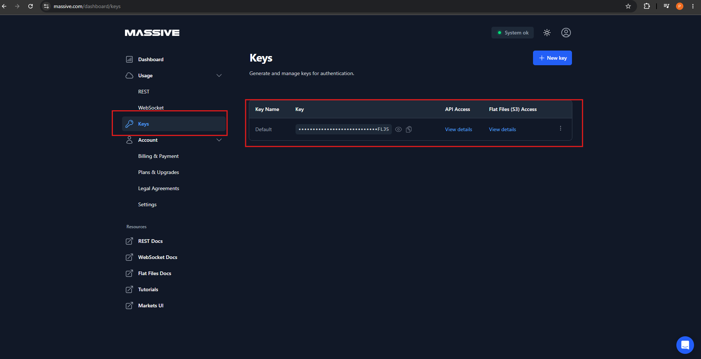
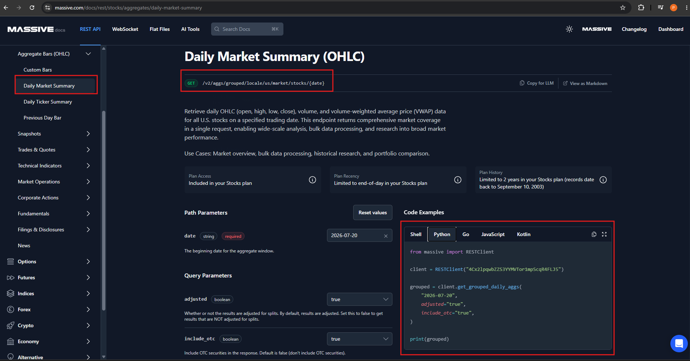

# 📈 Setup Massive API & Historical Market Data Ingestion


---

# 📖 Overview

This guide demonstrates how to configure the **Massive REST API** and use Python to extract historical U.S. stock market data.

The Massive API provides REST endpoints for accessing market data such as:

- 📈 Open price
- 📊 High price
- 📉 Low price
- 💰 Close price
- 📦 Volume
- 💹 VWAP
- 🕒 Trading timestamps

For this project, the **Daily Market Summary (OHLC)** endpoint is used to retrieve market data for a specific trading date.

The extracted data is processed by the Python script:

```text
ingestion/historical/massive_extract.py
````

and saved as a CSV file for further processing.

---

# 🎯 Learning Objectives

After completing this guide, you will be able to:

* Create and manage a Massive API key
* Configure API authentication securely
* Understand the Massive REST API
* Identify the Daily Market Summary endpoint
* Install the required Python package
* Configure the API client
* Extract historical market data
* Save API results into CSV files
* Validate the extracted data
* Organize historical ingestion code

---

# 📋 Prerequisites

Before starting, ensure you have:

* Python 3.x installed
* `pip` installed
* Internet connectivity
* Massive API account
* Massive API key
* Basic Python knowledge
* Access to the project repository

Verify Python:

```bash
python --version
```

Verify pip:

```bash
pip --version
```

---

# 📸 Step-by-Step Setup

---

# 🚀 Step 1 — Open Massive Dashboard

Log in to your **Massive** account and open the dashboard.

Navigate to:

```text
Dashboard
    │
    ▼
Usage
    │
    ▼
Keys
```

The **Keys** section is used to generate and manage API keys used for authentication.

<div align="center">



</div>

---

# 🚀 Step 2 — Create or Retrieve API Key

From the **Keys** page:

1. Click **+ New key** if you need to create a new key.
2. Give the key a meaningful name.
3. Generate the API key.
4. Copy the API key securely.
5. Do not expose the key in GitHub or source code.

The API key is required by the Python REST client when making API requests.

> 🔐 **Security Note:** Never commit the real API key to GitHub.

---

# 🚀 Step 3 — Configure API Key

For local development, store the API key as an environment variable instead of hard-coding it in Python.

```text
MASSIVE_API_KEY=*************************FLJ5
```

> ⚠️ Do not include the actual API key in documentation, screenshots, Git commits, or source code.

---

# 🚀 Step 4 — Install Massive Python Package

Install the Python package required by the project.

```bash
pip install requests
```

Verify the installation:

```bash
pip show requests
```

---

# 🚀 Step 5 — Open Massive API Documentation

Open the Massive REST API documentation.

Navigate to:

```text
REST API
    │
    ▼
Stocks
    │
    ▼
Aggregate Bars
    │
    ▼
Daily Market Summary
```

The **Daily Market Summary (OHLC)** endpoint provides daily market information for U.S. stocks for a specified date.

<div align="center">



</div>

---

# 🚀 Step 6 — Identify the API Endpoint

The Daily Market Summary endpoint is:

```text
GET /v2/aggs/grouped/locale/us/market/stocks/{date}
```

The `{date}` parameter represents the requested trading date.

Example:

```text
/v2/aggs/grouped/locale/us/market/stocks/2026-07-20
```

The endpoint can be used to retrieve daily market data for the specified trading date.

---

# 🚀 Step 7 — Configure API Parameters

The API documentation provides the following parameters.

| Parameter     | Type    | Description               | Example      |
| ------------- | ------- | ------------------------- | ------------ |
| `date`        | String  | Trading date              | `2026-07-20` |
| `adjusted`    | Boolean | Adjust results for splits | `true`       |
| `include_otc` | Boolean | Include OTC securities    | `false`       |

Example configuration:

```python
url = f"{BASE_URL}/v2/aggs/grouped/locale/us/market/stocks/{date}"
params = {
    "adjusted": "true",
    "include_otc": "false",
    "apiKey": API_KEY,
}
response = requests.get(url, params=params)
response.raise_for_status()
data = response.json()
```

---

# 🚀 Step 8 — Create Historical Extraction Script

The historical extraction logic is implemented in:

```text
ingestion/
└── historical/
    └── massive_extract.py
```

### 📘 Source File

[🐍 `massive_extract.py`](../../../ingestion/historical/massive_extract.py)

The script is responsible for:

* 🔐 Reading the API key
* 📡 Connecting to Massive API
* 📅 Selecting the trading date
* 📈 Requesting market data
* 📄 Processing the API response
* 💾 Saving the extracted data as CSV

---

# 🚀 Step 9 — Configure the REST Client

Read the API key from the environment:

```python
import os

api_key = os.getenv("MASSIVE_API_KEY")

if not api_key:
    raise ValueError(
        "MASSIVE_API_KEY environment variable is not set"
    )
```

---

# 🚀 Step 10 — Extract Historical Market Data

Define the required trading date:

```python
trade_date = "2026-07-20"
```

Call the Daily Market Summary endpoint:

```python
grouped = client.get_grouped_daily_aggs(
    trade_date,
    adjusted="true",
    include_otc="true",
)
```

The API returns daily market data for the requested date.

---

# 🚀 Step 11 — Save Data to CSV

The extracted records are written into a CSV file.

Example output filename:

```text
massive_eod_20260720.csv
```

Example CSV structure:

```text
ticker,open,high,low,close,volume,vwap,timestamp
AAPL,....,....,....,....,....,....,....
MSFT,....,....,....,....,....,....,....
AMZN,....,....,....,....,....,....,....
GOOGL,....,....,....,....,....,....,....
```

The CSV provides a simple file-based representation of the extracted historical market data.

---

# 🚀 Step 12 — Run the Historical Extraction

From the project root, execute:

```bash
python ingestion/historical/massive_extract.py
```

The script calls the Massive API and writes the historical market data into the configured CSV output location.

Example:

```text
Historical market data saved to:
massive_eod_20260720.csv
```

---

# 🚀 Step 13 — Verify the CSV Output

After execution, verify that the CSV file has been created.

### Windows

```powershell
dir
```

### Linux / macOS

```bash
ls
```

Expected output:

```text
massive_eod_20260720.csv
```

Open the file and verify that:

* ✅ File exists
* ✅ Header is present
* ✅ Ticker values are populated
* ✅ OHLC values are populated
* ✅ Volume values are populated
* ✅ Trading date is correct
* ✅ Multiple market records are available

---

# 📓 Historical Ingestion Source

The project uses the following Python source file:

| Source File                                                                 | Description                                                           |
| --------------------------------------------------------------------------- | --------------------------------------------------------------------- |
| [🐍 `massive_extract.py`](../../../ingestion/historical/massive_extract.py) | Calls the Massive REST API and saves historical market data into CSV. |

---

## 📋 Source Responsibilities

The `massive_extract.py` script performs the following tasks:

* 🔑 API authentication
* 📅 Historical date configuration
* 📡 REST API request
* 📊 Market data extraction
* 🔄 Response processing
* 📄 CSV generation

---

## 🐍 Source Structure

```text
massive_extract.py
│
├── Load API key
│
├── Create REST client
│
├── Configure trading date
│
├── Call Daily Market Summary API
│
├── Process API response
│
└── Save records to CSV
```

---

# 📊 Output Data

The historical extraction generates CSV data containing daily market information.

Typical fields include:

| Column      | Description                   |
| ----------- | ----------------------------- |
| `ticker`    | Stock ticker symbol           |
| `open`      | Opening price                 |
| `high`      | Highest price                 |
| `low`       | Lowest price                  |
| `close`     | Closing price                 |
| `volume`    | Trading volume                |
| `vwap`      | Volume-weighted average price |
| `timestamp` | Market-data timestamp         |

> ℹ️ The exact fields should match the response returned by the Massive API/client version used by the project.

---

# 🔐 API Security

API credentials must be protected.

### ❌ Do not hard-code the API key

```python
client = RESTClient(
    "YOUR_REAL_API_KEY"
)
```

### ✅ Use an environment variable

```python
api_key = os.getenv("MASSIVE_API_KEY")

client = RESTClient(api_key)
```

Add local environment files to `.gitignore`:

```gitignore
.env
*.env
```

### 🔒 Security Checklist

* 🔐 Never commit API keys
* 🔑 Use environment variables
* 📝 Use placeholder values in documentation
* 🚫 Do not expose credentials in screenshots
* 🔄 Rotate the API key if it is accidentally exposed

---

# 🧪 Validation

After running the extraction script, validate the generated dataset.

### File Validation

```text
CSV file exists
       │
       ▼
Header exists
       │
       ▼
Records available
       │
       ▼
Ticker values populated
       │
       ▼
OHLC values populated
       │
       ▼
Historical data validated
```

### Basic Python Validation

```python
import pandas as pd

df = pd.read_csv(
    "massive_eod_20260720.csv"
)

print(df.head())
print(df.shape)
print(df.columns)
```

---

# 🐛 Troubleshooting

## ❌ API Key Not Found

Error:

```text
MASSIVE_API_KEY environment variable is not set
```

Set the environment variable again.

### PowerShell

```powershell
$env:MASSIVE_API_KEY="your_api_key"
```

---

## ❌ Massive Package Not Found

Error:

```text
ModuleNotFoundError: No module named 'massive'
```

Install the package:

```bash
pip install massive
```

Then verify:

```bash
pip show massive
```

---

## ❌ Authentication Error

Check:

* 🔑 API key is valid
* 🔐 Environment variable is configured correctly
* 📡 Internet connection is available
* 📋 API access is available for your account

---

## ❌ No Data Returned

Verify:

* 📅 Trading date
* 📈 API endpoint
* 🔑 API access
* ⚙️ Request parameters
* 📊 API response

Also make sure the requested date is a valid market-data date.

---

## ❌ CSV File Not Created

Check:

* 🐍 Script executed successfully
* 📂 Output directory exists
* 🔐 Python process has write permission
* 📄 CSV-writing logic is executing

---

# 💡 Best Practices

* Use environment variables for API credentials.
* Keep API extraction logic separate from downstream processing.
* Use meaningful output filenames.
* Validate API responses before writing files.
* Validate the generated CSV after extraction.
* Keep API configuration outside business logic where possible.
* Use reusable functions for historical extraction.
* Avoid committing generated datasets containing unnecessary sensitive information.
* Keep the extraction script small and focused on ingestion.

---

# 📋 Implementation Progress

| Step | Task                                   | Status |
| ---- | -------------------------------------- | :----: |
| 1    | Open Massive Dashboard                 |    ✅   |
| 2    | Create / Retrieve API Key              |    ✅   |
| 3    | Configure API Key                      |    ✅   |
| 4    | Install Massive Python Package         |    ✅   |
| 5    | Open REST API Documentation            |    ✅   |
| 6    | Identify Daily Market Summary Endpoint |    ✅   |
| 7    | Configure API Parameters               |    ✅   |
| 8    | Create Historical Extraction Script    |    ✅   |
| 9    | Configure REST Client                  |    ✅   |
| 10   | Extract Historical Market Data         |    ✅   |
| 11   | Save Data to CSV                       |    ✅   |
| 12   | Run Extraction Script                  |    ✅   |
| 13   | Verify CSV Output                      |    ✅   |

---

# 🎯 Key Takeaways

* 🔑 Massive API keys are required for authenticated API access.
* 📚 The Massive REST API provides market-data endpoints.
* 📈 Daily Market Summary provides daily OHLC market information.
* 🐍 Python is used to call the API.
* 📂 Historical extraction is implemented in `massive_extract.py`.
* 📄 Extracted records are stored as CSV.
* 🔐 API credentials must remain outside source code.
* ✅ Generated files should be validated before downstream processing.

---

# 🏆 Summary

The Massive API setup provides the external market-data source for historical EOD data extraction.
