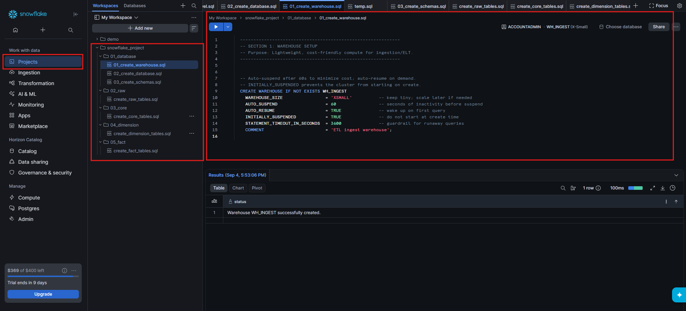

# ❄️ Snowflake Data Warehouse Setup & SQL Scripts


---

# 📖 Overview

This guide demonstrates how to create the foundational **Snowflake resources** required for the EOD Securities Pricing Analytics data pipeline.

The setup includes:

- ⚙️ Snowflake Virtual Warehouse
- 🗄️ Snowflake Database
- 📂 Snowflake Schemas

The resources are created using SQL scripts stored in the project repository.

The warehouse is configured specifically for **ETL and data ingestion workloads**, with cost-conscious settings such as:

- `XSMALL` warehouse size
- Automatic suspension after inactivity
- Automatic resume when queries are executed
- Initially suspended state
- Statement timeout protection

---

# 🎯 Learning Objectives

After completing this guide, you will be able to:

- Understand Snowflake virtual warehouses
- Create a cost-efficient ETL warehouse
- Configure warehouse auto-suspend
- Configure warehouse auto-resume
- Create a Snowflake database
- Create schemas inside a database
- Organize Snowflake SQL scripts
- Verify Snowflake resources using SQL
- Prepare Snowflake for data ingestion

---

# 🏗️ Snowflake Resource Hierarchy

Snowflake organizes data resources using a hierarchical structure.

```text
Snowflake Account
       │
       ▼
   Warehouse
   WH_INGEST
       │
       │  Compute
       ▼
    Database
    SEC_PRICING
       │
       ├──────────────────────┐
       ▼                      ▼
  RAW_SCHEMA             Other Schemas
       │
       ├── RAW Tables
       ├── Stages
       ├── Pipes
       └── Integrations
````

> 💡 **Important:** A warehouse provides compute resources, while databases and schemas organize data objects.

---

# 📋 Prerequisites

Before starting, ensure you have:

* Snowflake account
* Snowflake user
* Appropriate privileges to create warehouses
* Appropriate privileges to create databases and schemas
* Snowflake SQL Worksheet
* Access to the project repository

---

## 📂 Snowflake Layer Structure

The Snowflake environment is organized into separate SQL script directories
for database setup and analytical data layers.

```text
Snowflake
│
├── 01_database    → Warehouse, Database & Schema setup
├── 02_raw         → Raw ingestion tables
├── 03_core        → Core / standardized tables
├── 04_dimension   → Dimension tables
└── 05_fact        → Fact tables
```

---

# 🚀 Step 1 — Create Snowflake Warehouse

A **Virtual Warehouse** provides the compute resources required to execute SQL queries and perform ETL operations.

For this project, the warehouse is named:

```text
WH_INGEST
```

The warehouse is configured as an `XSMALL` warehouse to keep development and ingestion costs low.

---

## 📓 SQL Script

Source file:

[📘 `01_create_warehouse.sql`](../../snowflake/01_database/01_create_warehouse.sql)

```sql
---------------------------------------------------
-- SECTION 1: WAREHOUSE SETUP
-- Purpose: Lightweight, cost-friendly compute
--          for ingestion/ETL.
---------------------------------------------------

-- Auto-suspend after 60 seconds to minimize cost.
-- Auto-resume when a query requires the warehouse.
-- Initially suspended prevents the cluster from
-- starting immediately after creation.

CREATE WAREHOUSE IF NOT EXISTS WH_INGEST
    WAREHOUSE_SIZE              = 'XSMALL'
    AUTO_SUSPEND                = 60
    AUTO_RESUME                 = TRUE
    INITIALLY_SUSPENDED         = TRUE
    STATEMENT_TIMEOUT_IN_SECONDS = 3600
    COMMENT                     = 'ETL ingest warehouse';
```

---

# ⚙️ Warehouse Configuration

The warehouse uses the following configuration:

| Property            | Value                  | Purpose                              |
| ------------------- | ---------------------- | ------------------------------------ |
| Warehouse Name      | `WH_INGEST`            | ETL / ingestion compute              |
| Size                | `XSMALL`               | Lightweight compute                  |
| Auto Suspend        | `60 seconds`           | Reduce idle compute cost             |
| Auto Resume         | `TRUE`                 | Automatically start when required    |
| Initially Suspended | `TRUE`                 | Prevent unnecessary startup          |
| Statement Timeout   | `3600 seconds`         | Protect against long-running queries |
| Comment             | `ETL ingest warehouse` | Describes warehouse purpose          |

---

# 🚀 Step 2 — Execute Warehouse Creation

Open a Snowflake SQL Worksheet and execute:

```sql
CREATE WAREHOUSE IF NOT EXISTS WH_INGEST
    WAREHOUSE_SIZE               = 'XSMALL'
    AUTO_SUSPEND                 = 60
    AUTO_RESUME                  = TRUE
    INITIALLY_SUSPENDED          = TRUE
    STATEMENT_TIMEOUT_IN_SECONDS = 3600
    COMMENT                      = 'ETL ingest warehouse';
```

After successful execution, Snowflake should return a successful creation message.

Example:

```text
Warehouse WH_INGEST successfully created.
```

<div align="center">



</div>

---

# 🔍 Step 3 — Verify Warehouse

Verify that the warehouse exists:

```sql
SHOW WAREHOUSES LIKE 'WH_INGEST';
```

You can also inspect the warehouse configuration:

```sql
DESC WAREHOUSE WH_INGEST;
```

Verify the following properties:

```text
WAREHOUSE_SIZE
AUTO_SUSPEND
AUTO_RESUME
INITIALLY_SUSPENDED
STATEMENT_TIMEOUT_IN_SECONDS
```

---

# 🚀 Step 4 — Create Snowflake Database

The database provides the top-level logical container for the project's data objects.

The project database is:

```text
SEC_PRICING
```

---

## 📓 SQL Script

Source file:

[📘 `02_create_database.sql`](../../snowflake/01_database/02_create_database.sql)

Example database creation:

```sql
CREATE DATABASE IF NOT EXISTS SEC_PRICING
    COMMENT = 'EOD Securities Pricing Analytics database';
```

---

# 🔍 Step 5 — Verify Database

Run:

```sql
SHOW DATABASES LIKE 'SEC_PRICING';
```

Select the database:

```sql
USE DATABASE SEC_PRICING;
```

Verify the current database:

```sql
SELECT CURRENT_DATABASE();
```

Expected:

```text
SEC_PRICING
```

---

# 🚀 Step 6 — Create Database Schemas

Schemas provide logical separation for different types of Snowflake objects.

For this project, the raw ingestion layer uses:

```text
RAW_SCHEMA
```

---

## 📓 SQL Script

Source file:

[📘 `03_create_schemas.sql`](../../snowflake/01_database/03_create_schemas.sql)

Example:

```sql
USE DATABASE SEC_PRICING;

CREATE SCHEMA IF NOT EXISTS RAW_SCHEMA
    COMMENT = 'Raw ingestion schema for source data';
```

---

# 🔍 Step 7 — Verify Schema

Run:

```sql
SHOW SCHEMAS IN DATABASE SEC_PRICING;
```

Or:

```sql
SHOW SCHEMAS LIKE 'RAW_SCHEMA';
```

Verify the schema:

```sql
USE SCHEMA SEC_PRICING.RAW_SCHEMA;
```

Check the current schema:

```sql
SELECT CURRENT_SCHEMA();
```

Expected:

```text
RAW_SCHEMA
```

---

# 🧪 Step 8 — Validate Snowflake Environment

After creating the warehouse, database, and schema, verify the current configuration.

```sql
SELECT
    CURRENT_USER(),
    CURRENT_ROLE(),
    CURRENT_WAREHOUSE(),
    CURRENT_DATABASE(),
    CURRENT_SCHEMA();
```

The environment should be configured similar to:

```text
USER        → ACCOUNTADMIN / appropriate role
ROLE        → ACCOUNTADMIN / appropriate role
WAREHOUSE   → WH_INGEST
DATABASE    → SEC_PRICING
SCHEMA      → RAW_SCHEMA
```

---

# 📊 Resource Verification

| Resource          | Name         | Purpose                 | Status |
| ----------------- | ------------ | ----------------------- | :----: |
| Virtual Warehouse | `WH_INGEST`  | ETL / ingestion compute |    ✅   |
| Database          | `SEC_PRICING`   | Project data container  |    ✅   |
| Schema            | `RAW_SCHEMA` | Raw ingestion objects   |    ✅   |

---

# 🔄 Setup Sequence

The resources should be created in the following order:

```text
01_create_warehouse.sql
          │
          ▼
    WH_INGEST
          │
          ▼
02_create_database.sql
          │
          ▼
      SEC_PRICING
          │
          ▼
03_create_schemas.sql
          │
          ▼
    RAW_SCHEMA
```

---

# 💡 Why Use a Separate ETL Warehouse?

A dedicated ingestion warehouse provides better workload organization.

```text
                    Snowflake
                       │
             ┌─────────┴─────────┐
             │                   │
             ▼                   ▼
       WH_INGEST             Other Warehouses
             │
             ▼
      ETL / Ingestion
             │
             ▼
          SEC_PRICING
```

Benefits include:

* ⚙️ Workload isolation
* 💰 Better cost management
* 📊 Easier monitoring
* 🔄 Independent warehouse scaling
* 🛡️ Better resource management

---

# 💰 Cost Optimization

The warehouse is configured with:

```sql
AUTO_SUSPEND = 60
```

This automatically suspends the warehouse after the configured period of inactivity.

The warehouse also uses:

```sql
AUTO_RESUME = TRUE
```

This allows Snowflake to automatically resume the warehouse when a query requires compute.

The combination helps reduce unnecessary compute usage during periods of inactivity.

---

# 🔐 Security & Access

Use appropriate Snowflake roles when creating and managing resources.

Avoid using highly privileged roles for normal ETL operations.

Recommended approach:

```text
ADMIN Role
    │
    ├── Create warehouse
    ├── Create database
    └── Create schemas
            │
            ▼
       ETL Role
            │
            └── Perform ingestion / transformation
```

### 🔒 Best Practices

* Use role-based access control.
* Follow least-privilege principles.
* Avoid using `ACCOUNTADMIN` for routine ETL workloads.
* Grant only the required warehouse privileges.
* Grant database and schema permissions explicitly.
* Use separate roles for administration and data processing.

---

# ⚠️ Common Issues

| Issue                    | Possible Solution                                    |
| ------------------------ | ---------------------------------------------------- |
| Warehouse already exists | `IF NOT EXISTS` prevents unnecessary creation errors |
| Database already exists  | Use `CREATE DATABASE IF NOT EXISTS`                  |
| Schema already exists    | Use `CREATE SCHEMA IF NOT EXISTS`                    |
| Permission denied        | Verify the active Snowflake role                     |
| Warehouse suspended      | Execute a query or enable auto-resume                |
| Wrong database           | Run `USE DATABASE SEC_PRICING`                          |
| Wrong schema             | Run `USE SCHEMA SEC_PRICING.RAW_SCHEMA`                 |
| Query timeout            | Review `STATEMENT_TIMEOUT_IN_SECONDS`                |

---

# 🧰 Useful Snowflake Commands

### Show Warehouses

```sql
SHOW WAREHOUSES;
```

### Describe Warehouse

```sql
DESC WAREHOUSE WH_INGEST;
```

### Show Databases

```sql
SHOW DATABASES;
```

### Show Schemas

```sql
SHOW SCHEMAS IN DATABASE SEC_PRICING;
```

### Show Tables

```sql
SHOW TABLES IN SCHEMA SEC_PRICING.RAW_SCHEMA;
```

### Check Current Context

```sql
SELECT
    CURRENT_WAREHOUSE(),
    CURRENT_DATABASE(),
    CURRENT_SCHEMA();
```

---

# 📋 Implementation Progress

| Step | Task                         | Status |
| ---- | ---------------------------- | :----: |
| 1    | Create Snowflake Warehouse   |    ✅   |
| 2    | Configure `XSMALL` warehouse |    ✅   |
| 3    | Configure Auto Suspend       |    ✅   |
| 4    | Configure Auto Resume        |    ✅   |
| 5    | Configure Initial Suspension |    ✅   |
| 6    | Configure Statement Timeout  |    ✅   |
| 7    | Create `SEC_PRICING` database   |    ✅   |
| 8    | Create `RAW_SCHEMA` schema   |    ✅   |
| 9    | Verify Warehouse             |    ✅   |
| 10   | Verify Database              |    ✅   |
| 11   | Verify Schema                |    ✅   |
| 12   | Validate Snowflake Context   |    ✅   |

---

# 📚 SQL Scripts

The Snowflake database objects are organized into separate SQL scripts based on their purpose.

## ⚙️ Database Setup

| Script | Description |
|--------|-------------|
| [📘 `01_create_warehouse.sql`](../../snowflake/01_database/01_create_warehouse.sql) | Creates and configures the `WH_INGEST` virtual warehouse |
| [📘 `02_create_database.sql`](../../snowflake/01_database/02_create_database.sql) | Creates the `SALES_DB` database |
| [📘 `03_create_schemas.sql`](../../snowflake/01_database/03_create_schemas.sql) | Creates the required database schemas |

---

## 🧱 Raw Layer

| Script | Description |
|--------|-------------|
| [📘 `create_raw_tables.sql`](../../snowflake/02_raw/create_raw_tables.sql) | Creates raw-layer tables for storing ingested source data |

---

## 🏗️ Core Layer

| Script | Description |
|--------|-------------|
| [📘 `create_core_tables.sql`](../../snowflake/03_core/create_core_tables.sql) | Creates core tables used for structured and standardized data |

---

## 📐 Dimension Layer

| Script | Description |
|--------|-------------|
| [📘 `create_dimension_tables.sql`](../../snowflake/04_dimension/create_dimension_tables.sql) | Creates dimension tables used for analytical processing |

---

## 📊 Fact Layer

| Script | Description |
|--------|-------------|
| [📘 `create_fact_tables.sql`](../../snowflake/05_fact/create_fact_tables.sql) | Creates fact tables containing measurable business events and metrics |
---

# 🎯 Key Takeaways

* ❄️ Snowflake separates compute from storage.
* ⚙️ `WH_INGEST` provides compute for ingestion and ETL.
* 💰 Auto-suspend helps reduce idle compute costs.
* 🔄 Auto-resume automatically starts compute when required.
* 🗄️ `SEC_PRICING` provides the project's database container.
* 📂 `RAW_SCHEMA` organizes raw ingestion objects.
* 🔐 Snowflake roles should follow least-privilege principles.
* 📋 SQL scripts keep infrastructure configuration version-controlled and reproducible.

---