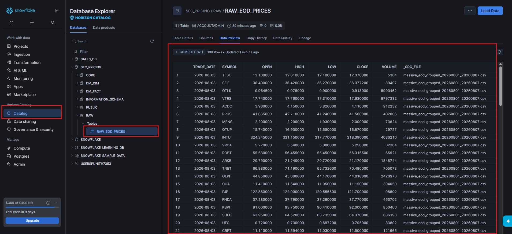
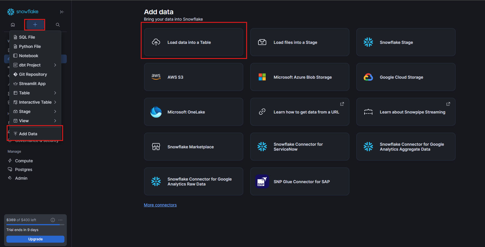
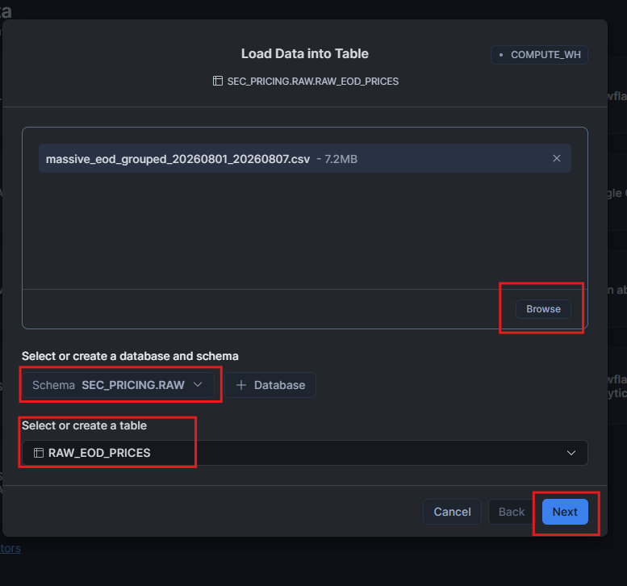

# 📥 Historical Data Backfill — Snowflake RAW Layer


---

# 📖 Overview

This guide demonstrates how to perform a **historical data backfill** by manually uploading a previously generated CSV file into a Snowflake raw table.

The historical dataset is generated by the **Massive API extraction process** and stored as a CSV file.

For this project, the historical file is:

```text
massive_eod_grouped_20260801_20260807.csv
````

The file is loaded into the Snowflake raw table:

```text
SEC_PRICING.RAW.RAW_EOD_PRICES
```

This process is useful when historical market data needs to be loaded into Snowflake before automated ingestion is enabled.

---

# 🎯 Learning Objectives

After completing this guide, you will be able to:

* 📥 Upload a historical CSV file into Snowflake
* ❄️ Use the Snowflake **Add Data** interface
* 📂 Select an existing database and schema
* 🗄️ Select the target raw table
* 📊 Load historical EOD pricing data
* 🔍 Verify the loaded records
* 🧪 Confirm that the historical backfill was successful

---

# 🏗️ Target Snowflake Table

The historical data is loaded into:

```text
Database : SEC_PRICING
Schema   : RAW
Table    : RAW_EOD_PRICES
```

The target table contains EOD market pricing information such as:

| Column       | Description          |
| ------------ |----------------------|
| `TRADE_DATE` | Trading date         |
| `SYMBOL`     | Stock ticker symbol  |
| `OPEN`       | Opening price        |
| `HIGH`       | Highest price        |
| `LOW`        | Lowest price         |
| `CLOSE`      | Closing price        |
| `VOLUME`     | Trading volume       |
| `_SRC_FILE`  | Source CSV file name |
| `_INGEST_TS` | Ingested Time        |

---

# 📂 Historical Source File

The historical data file used for the backfill is:

```text
massive_eod_grouped_20260801_20260807.csv
```

Example file size shown during the upload:

```text
7.2 MB
```

The file contains historical EOD pricing data collected from the Massive API.

> 💡 **Note:** The CSV file should be generated by the project's historical extraction process before performing this step.

---

# 🚀 Step 1 — Open Snowflake Catalog

Open the Snowflake interface and navigate to:

```text
Catalog
    ↓
SEC_PRICING
    ↓
RAW
    ↓
RAW_EOD_PRICES
```

The `RAW_EOD_PRICES` table is used as the destination for the historical market data.

---

# 📸 Snowflake Raw Table

The following screenshot shows the target `RAW_EOD_PRICES` table and its loaded historical records.

<div align="center">



</div>

The Snowflake Data Preview shows records containing:

```text
TRADE_DATE
SYMBOL
OPEN
HIGH
LOW
CLOSE
VOLUME
_SRC_FILE
_INGEST_TS

```

The `_SRC_FILE` column identifies the CSV file from which the records originated.

---

# 🚀 Step 2 — Open Add Data

From the Snowflake interface:

```text
+
 ↓
Add Data
 ↓
Load data into Table
```

Select:

```text
Load data into Table
```

This opens the Snowflake file upload interface.

---

# 📸 Open Add Data

<div align="center">



</div>

The **Add Data** interface provides multiple ingestion options.

For this historical backfill, use:

```text
Load data into Table
```

> 💡 **Important:** This step is a manual historical backfill. It is not Snowpipe-based automatic ingestion.

---

# 🚀 Step 3 — Upload Historical CSV

In the **Load Data into Table** dialog, select:

```text
Browse
```

Choose the historical CSV file:

```text
massive_eod_grouped_20260801_20260807.csv
```

The uploaded file should appear in the file selection area.

Example:

```text
massive_eod_grouped_20260801_20260807.csv
7.2 MB
```

---

# 📸 Upload Historical File

<div align="center">


</div>

After selecting the file, verify that the correct CSV file is displayed before continuing.

---

# 🚀 Step 4 — Select Database, Schema & Table

Under:

```text
Select or create a database and schema
```

select the target schema:

```text
SEC_PRICING.RAW
```

Then under:

```text
Select or create a table
```

select:

```text
RAW_EOD_PRICES
```

The target should be:

```text
SEC_PRICING.RAW.RAW_EOD_PRICES
```

---

# 📸 Select Target Table

<div align="center">



</div>

Before clicking **Next**, verify:

```text
Schema
SEC_PRICING.RAW

Table
RAW_EOD_PRICES
```

Then click:

```text
Next
```

---

# 🚀 Step 5 — Complete the Data Load

Snowflake processes the selected CSV file and loads the records into:

```text
SEC_PRICING.RAW.RAW_EOD_PRICES
```

After the load is completed, open the target table and select:

```text
Data Preview
```

This allows you to verify the historical records.

---

# 🔍 Step 6 — Verify Historical Data

Open:

```text
Catalog
 ↓
SEC_PRICING
 ↓
RAW
 ↓
RAW_EOD_PRICES
 ↓
Data Preview
```

Verify that the historical records are available.

The Data Preview should contain columns such as:

```text
TRADE_DATE
SYMBOL
OPEN
HIGH
LOW
CLOSE
VOLUME
_SRC_FILE
_INGEST_TS
```

---

# 📊 Data Verification

The screenshot shows historical records loaded into the raw table.

Example:

```text
TRADE_DATE   SYMBOL   OPEN       HIGH       LOW        CLOSE      VOLUME
2026-08-03   TESL     12.100000  12.610000  12.100000  12.370000  5384
2026-08-03   SEIE     36.400000  36.420000  36.270000  36.377200  80497
2026-08-03   OTLK     0.964500   0.975000   0.900000   0.913000   5993462
```

The `_SRC_FILE` column identifies the source file:

```text
massive_eod_grouped_20260801_20260807.csv
```

---

# 🧪 SQL Validation

After the manual upload, the table can also be validated using SQL.

## Check Loaded Records

```sql
SELECT *
FROM SEC_PRICING.RAW.RAW_EOD_PRICES
LIMIT 100;
```

---

## Check Row Count

```sql
SELECT COUNT(*) AS TOTAL_ROWS
FROM SEC_PRICING.RAW.RAW_EOD_PRICES;
```

---

## Check Historical Date Range

```sql
SELECT
    MIN(TRADE_DATE) AS MIN_TRADE_DATE,
    MAX(TRADE_DATE) AS MAX_TRADE_DATE
FROM SEC_PRICING.RAW.RAW_EOD_PRICES;
```

---

## Check Source File

```sql
SELECT
    _SRC_FILE,
    COUNT(*) AS ROW_COUNT
FROM SEC_PRICING.RAW.RAW_EOD_PRICES
GROUP BY _SRC_FILE
ORDER BY ROW_COUNT DESC;
```

This helps confirm which source files contributed records to the raw table.

---

# 📋 Historical Backfill Validation Checklist

| Validation            | Expected Result            | Status |
| --------------------- | -------------------------- | :----: |
| CSV file selected     | Historical Massive API CSV |    ✅   |
| File uploaded         | CSV visible in Snowflake   |    ✅   |
| Database selected     | `SEC_PRICING`              |    ✅   |
| Schema selected       | `RAW`                      |    ✅   |
| Target table selected | `RAW_EOD_PRICES`           |    ✅   |
| Data loaded           | Records available          |    ✅   |
| Data Preview checked  | Historical records visible |    ✅   |
| Source file verified  | `_SRC_FILE` populated      |    ✅   |
| Date range verified   | Historical dates available |    ✅   |

---

# 🔐 Best Practices

### 📂 Validate the Source File

Before uploading:

* Verify the CSV file name.
* Confirm the expected file size.
* Check that the file contains the expected columns.
* Make sure the historical date range is correct.

### 🗄️ Validate the Target

Always confirm:

```text
Database → SEC_PRICING
Schema   → RAW
Table    → RAW_EOD_PRICES
```

### 🔍 Verify After Loading

Do not assume that a successful upload means the data is correct.

Validate:

* Row count
* Date range
* Symbols
* Pricing columns
* Source file

### 🔄 Preserve Source Information

The `_SRC_FILE` column provides useful lineage information by identifying the originating CSV file.

---

# ⚠️ Important

This procedure is specifically for **historical backfill**.

```text
Historical CSV
      │
      ▼
Snowflake Add Data
      │
      ▼
SEC_PRICING.RAW.RAW_EOD_PRICES
```

It is a **manual file upload process** and should be distinguished from the project's automated ingestion mechanisms such as Snowpipe.

---

# 🧭 When to Use Historical Backfill

Historical backfill is useful when:

* 📅 Loading previously collected market data
* 📊 Initializing the raw layer
* 🔄 Recovering missing historical periods
* 🧪 Preparing data for development and testing
* 🏗️ Populating the warehouse before automated ingestion

---

# 📸 Screenshots

## 1️⃣ Add Data

Shows the Snowflake **Add Data → Load data into Table** option.

```text
images/01_upload_data.png
```

<div align="center">


</div>

---

## 2️⃣ Select Database, Schema & Table

Shows selection of:

```text
SEC_PRICING
    ↓
RAW
    ↓
RAW_EOD_PRICES
```

```text
images/02_select_database.png
```

<div align="center">


</div>

---

## 3️⃣ Verify Historical Raw Data

Shows the historical EOD pricing records loaded into the raw table.

```text
images/03_view_historical_raw_data.png
```

<div align="center">


</div>

---

# 🎯 Key Takeaways

* 📥 Historical EOD data can be manually loaded into Snowflake.
* ❄️ Snowflake provides a UI-based **Load data into Table** option.
* 🗄️ The target table for this project is `SEC_PRICING.RAW.RAW_EOD_PRICES`.
* 📊 The historical CSV is generated from the Massive API extraction process.
* 🔍 Data should be verified after loading.
* 🧾 `_SRC_FILE` provides source-file traceability.
* 🔄 Historical backfill is separate from automated Snowpipe ingestion.

---