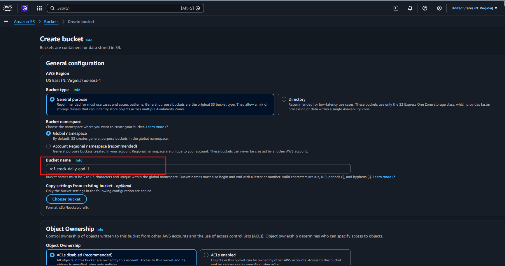
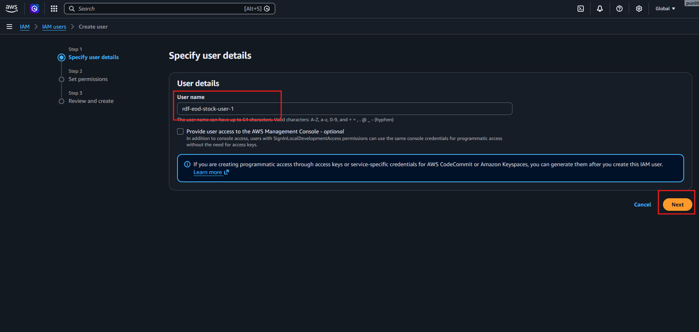
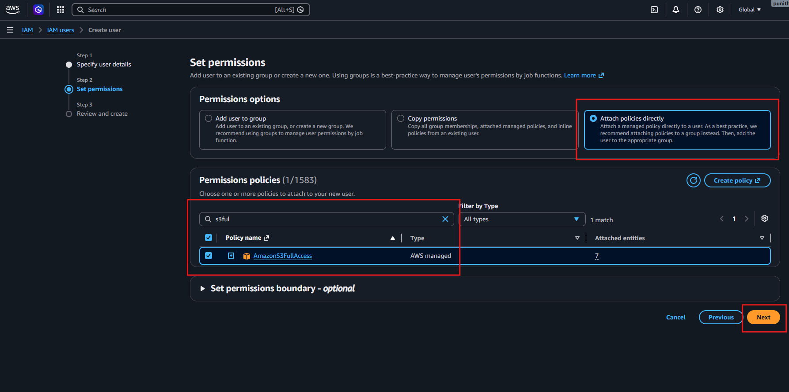
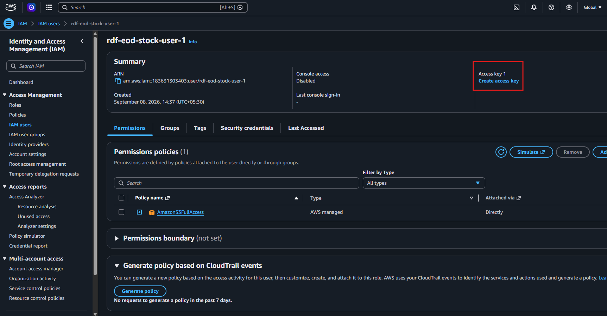
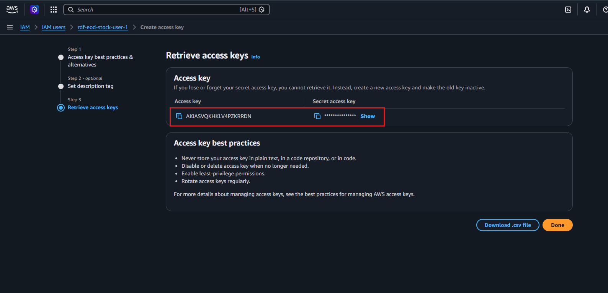
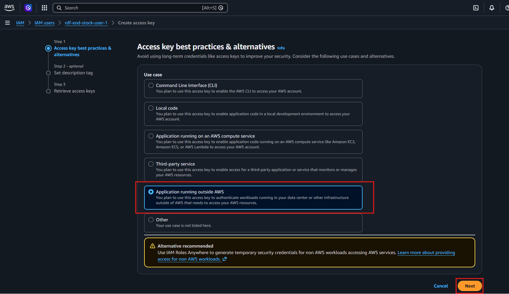
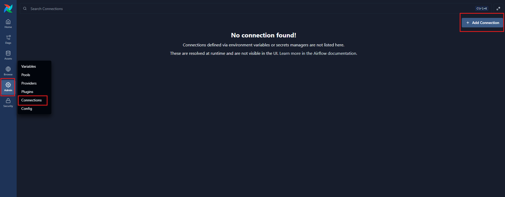
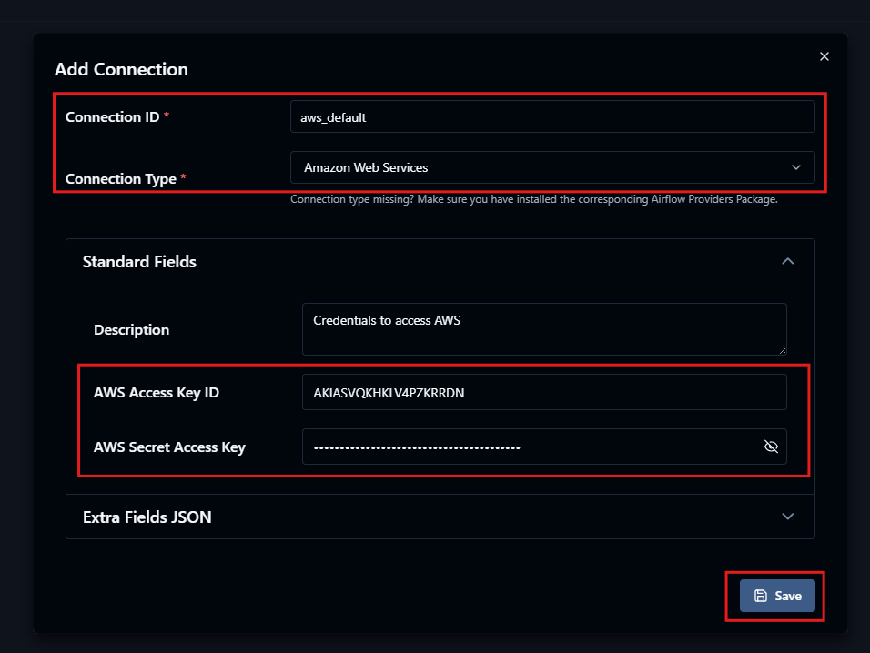
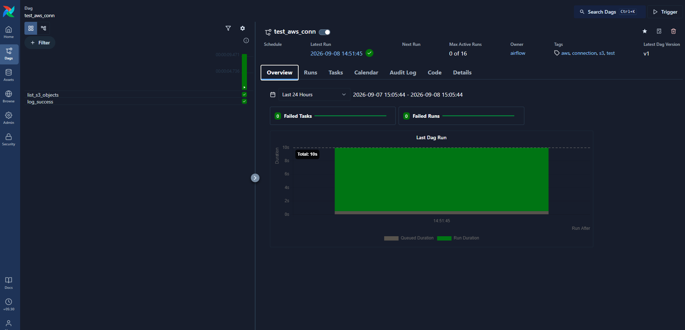

# ☁️ AWS S3 & IAM Setup for Apache Airflow


## 📖 Overview

This document describes the setup required to allow **Apache Airflow** to access an **Amazon S3 bucket** using an **AWS IAM user and access keys**.

The setup creates:

* 🪣 An Amazon S3 bucket for EOD stock data
* 👤 An AWS IAM user for programmatic access
* 🔐 S3 permissions for the IAM user
* 🔑 AWS Access Key ID and Secret Access Key
* 🔗 An `aws_default` connection in Airflow
* 📦 A foundation for uploading EOD CSV files from Airflow to S3

---

## 🎯 Objectives

By completing this setup, you will have:

```text
Apache Airflow
      │
      │ AWS Connection
      ▼
AWS IAM User
      │
      │ S3 Permissions
      ▼
Amazon S3
      │
      ▼
EOD Stock CSV Files
```

---

# 📑 Table of Contents

* ☁️ AWS S3 & IAM Setup
* 📖 Overview
* 🎯 Objectives
* 🛠️ Prerequisites
* 🪣 Step 1 — Create an S3 Bucket
* 👤 Step 2 — Create an IAM User
* 🔐 Step 3 — Attach S3 Permissions
* 🔑 Step 4 — Create an Access Key
* 📋 Step 5 — Retrieve Access Keys
* 🌬️ Step 6 — Configure AWS Connection in Airflow
* 🔗 Step 7 — Create `aws_default` Connection
* 🧪 Step 8 — Verify the Connection
* 🔒 Security Best Practices

---

# 🛠️ Prerequisites

Before starting, make sure you have:

* ☁️ An AWS account
* 🪣 Permission to create S3 buckets
* 👤 Permission to create IAM users
* 🌬️ Apache Airflow running locally
* 🌐 Access to the Airflow Web UI

---

# 🪣 Step 1 — Create an S3 Bucket

Create an S3 bucket that will be used to store the EOD stock data.

In this project, the bucket name is:

```text
rdf-stock-daily-eod-1
```

The bucket is configured as a **General purpose** S3 bucket.

### 📸 S3 Bucket Configuration



> **Note:** S3 bucket names must be globally unique when using the global namespace. If the name is already unavailable, use another unique bucket name.

---

# 👤 Step 2 — Create an IAM User

Create a dedicated IAM user for programmatic access to AWS resources.

Example user:

```text
rdf-eod-stock-user-1
```

The user is intended for application/workflow access rather than AWS Management Console access.

### 📸 Create IAM User



The IAM user will later be used to generate AWS access keys.

---

# 🔐 Step 3 — Attach S3 Permissions

The IAM user requires permission to access Amazon S3.

For this project, the following AWS-managed policy was attached:

```text
AmazonS3FullAccess
```

### 📸 Attach S3 Policy



This allows the Airflow workflow to interact with S3 using the credentials associated with the IAM user.

> ⚠️ **Production recommendation:** `AmazonS3FullAccess` is convenient for learning and development, but production environments should use a least-privilege custom policy restricted to the required bucket and operations.

---

# 🔑 Step 4 — Create an Access Key

After creating the IAM user, create an access key for programmatic access.

Navigate to:

```text
AWS Console
   ↓
IAM
   ↓
Users
   ↓
rdf-eod-stock-user-1
   ↓
Security credentials
   ↓
Create access key
```

During the access-key creation process, select:

```text
Application running outside AWS
```

This is appropriate for a local Airflow installation accessing AWS from outside AWS infrastructure.

### 📸 Create Access Key



Click:

```text
Next
```

and continue through the access-key creation process.

---

# 📋 Step 5 — Retrieve Access Keys

AWS generates two credentials:

```text
AWS Access Key ID
AWS Secret Access Key
```

Example format:

```text
Access Key ID:
AKIA................
```

```text
Secret Access Key:
********************************
```

### 📸 Retrieve Access Keys



> 🔒 **Important:** The Secret Access Key is shown only when the key is created. Store it securely and never commit it to Git.

---

# 🔐 Access Key Configuration

The access key information will be used when creating the Airflow AWS connection.

The configuration requires:

| Field                 | Value                            |
| --------------------- | -------------------------------- |
| Connection ID         | `aws_default`                    |
| Connection Type       | `Amazon Web Services`            |
| AWS Access Key ID     | Your generated Access Key ID     |
| AWS Secret Access Key | Your generated Secret Access Key |
| Description           | `Credentials to access AWS`      |

### 📸 AWS Credential Configuration



---

# 🌬️ Step 6 — Configure AWS Connection in Airflow

Open the Airflow Web UI.

Navigate to:

```text
Airflow UI
   ↓
Admin
   ↓
Connections
```

If no connection is configured, Airflow displays:

```text
No connection found!
```

Click:

```text
+ Add Connection
```

### 📸 Airflow Connections



---

# 🔗 Step 7 — Create `aws_default` Connection

Create the connection using the following configuration:

```text
Connection ID:
aws_default
```

```text
Connection Type:
Amazon Web Services
```

Then provide:

```text
AWS Access Key ID
AWS Secret Access Key
```

### 📋 Connection Configuration

| Field                     | Configuration               |
| ------------------------- | --------------------------- |
| **Connection ID**         | `aws_default`               |
| **Connection Type**       | `Amazon Web Services`       |
| **Description**           | `Credentials to access AWS` |
| **AWS Access Key ID**     | Your AWS Access Key ID      |
| **AWS Secret Access Key** | Your AWS Secret Access Key  |

### 📸 Add AWS Connection



Click:

```text
Save
```

---

# 🧪 Step 8 — Verify the Connection

After saving the connection, Airflow can use:

```text
aws_default
```

from DAGs and AWS provider operators/hooks.

For example:

```python
aws_conn_id = "aws_default"
```

This connection ID can be referenced by AWS-related Airflow components.

Example:

```python
from airflow.providers.amazon.aws.hooks.s3 import S3Hook

s3_hook = S3Hook(
    aws_conn_id="aws_default"
)
```

The connection flow is:

```text
AWS IAM
   │
   ├── Access Key ID
   └── Secret Access Key
          │
          ▼
   Airflow Connection
      aws_default
          │
          ▼
      S3Hook / AWS Operator
          │
          ▼
      Amazon S3 Bucket
```

### 📸 Verify the Connection




---

# 🪣 S3 Bucket

The project uses the S3 bucket:

```text
rdf-stock-daily-eod-1
```

A possible project structure inside the bucket is:

```text
rdf-stock-daily-eod-1/
│
└── eod/
    ├── eod_2026-09-01.csv
    ├── eod_2026-09-02.csv
    ├── eod_2026-09-03.csv
    └── ...
```

This provides a central cloud storage location for the EOD data generated by the Airflow ingestion workflow.

---

# 🔄 AWS + Airflow Integration

The completed configuration is:

```text
┌───────────────────────────────┐
│       Apache Airflow          │
│                               │
│     aws_default Connection    │
└───────────────┬───────────────┘
                │
                │ Access Key
                │ Secret Key
                ▼
┌───────────────────────────────┐
│          AWS IAM              │
│                               │
│ rdf-eod-stock-user-1          │
│                               │
│ AmazonS3FullAccess            │
└───────────────┬───────────────┘
                │
                │ S3 permissions
                ▼
┌───────────────────────────────┐
│        Amazon S3              │
│                               │
│ rdf-stock-daily-eod-1         │
└───────────────────────────────┘
```

---

# 🔒 Security Best Practices

### 🚫 Never commit credentials

Do **not** place credentials directly in Python code:

```python
AWS_ACCESS_KEY = "AKIA..."
AWS_SECRET_KEY = "..."
```

Also never commit credentials into:

```text
.env
config files
DAG files
Git repositories
README files
```

---

### 🔐 Protect the Secret Access Key

The Secret Access Key should be treated as a password.

If it is accidentally exposed:

1. 🚨 Disable/delete the compromised access key.
2. 🔑 Create a new access key.
3. 🔄 Update the Airflow connection.
4. 🔍 Check the repository and logs for exposure.

---

### 🎯 Use Least Privilege

For learning, the project uses:

```text
AmazonS3FullAccess
```

For production, prefer a restricted IAM policy allowing only the required operations on the specific S3 bucket.

---

# 🎯 Key Takeaways

* ☁️ **Amazon S3** provides cloud object storage for EOD files.
* 👤 **IAM** controls access to AWS resources.
* 🔑 **Access keys** provide programmatic authentication.
* 🌬️ **Airflow Connections** securely centralize AWS connection details for DAGs.
* 🔗 `aws_default` is the connection ID used by the Airflow AWS integration.
* 🪣 The project uses an S3 bucket for storing EOD market-data files.
* 🔒 AWS credentials should never be committed to source control.
* 🎯 Production deployments should follow least-privilege IAM practices.

---