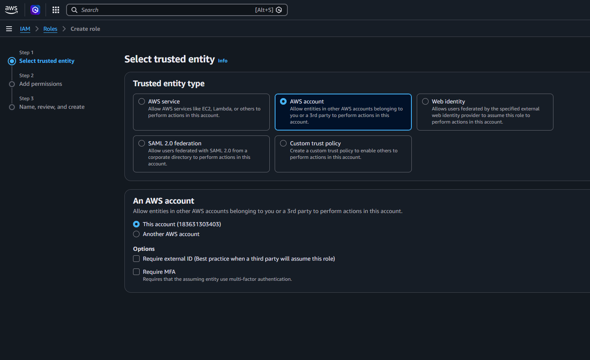
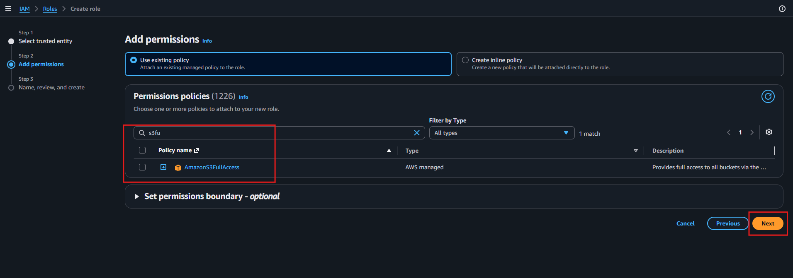
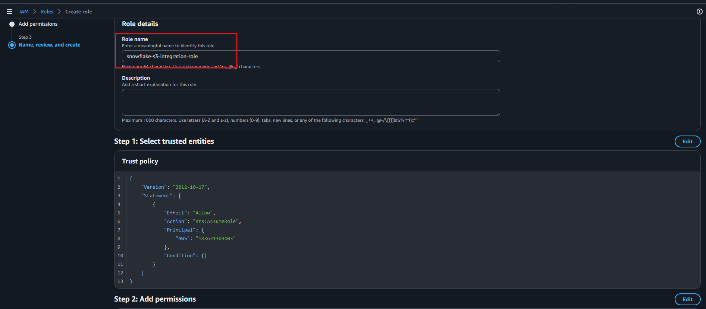
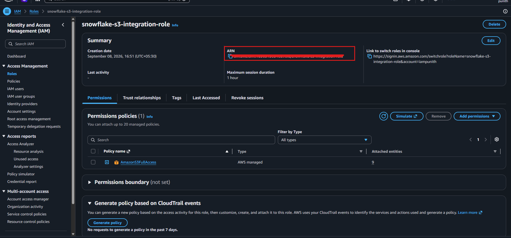
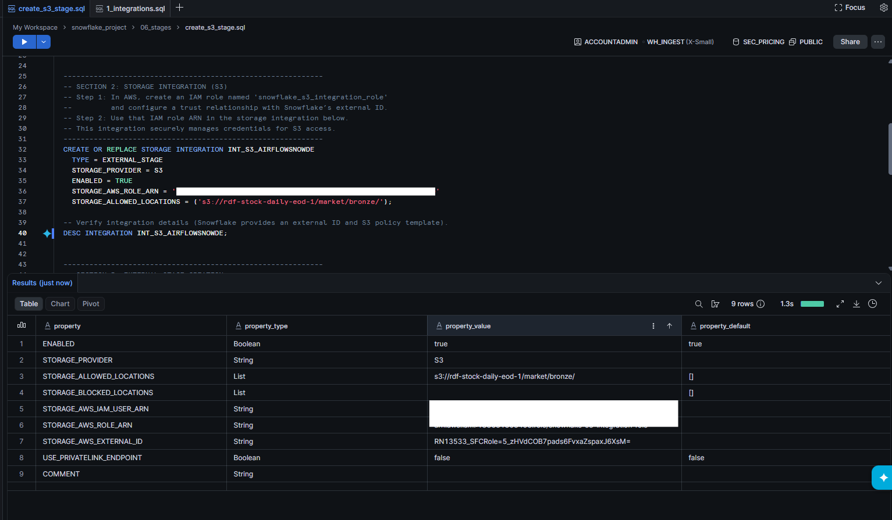
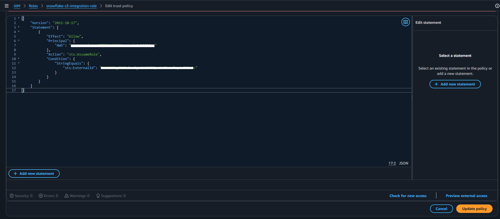

# 🔐 AWS IAM Role for Snowflake S3 Integration


> Configure an AWS IAM Role and establish the trust relationship required for Snowflake to access Amazon S3.

---

## 🎯 Objective

This configuration creates an AWS IAM Role that is used by the Snowflake S3 Storage Integration.

The setup covers:

- 🔐 AWS IAM Role creation
- 👤 AWS account trusted entity
- 🛡️ Amazon S3 permissions
- 🏷️ IAM Role naming
- 📋 IAM Role ARN
- ❄️ Snowflake Storage Integration
- 🤝 IAM Trust Policy
- 🔑 Snowflake External ID

---

# 1️⃣ Select Trusted Entity

Navigate to:

```text
AWS Console
    ↓
IAM
    ↓
Roles
    ↓
Create role
````

Under **Trusted entity type**, select:

```text
AWS account
```

The screenshot shows:

```text
Trusted entity type
        │
        └── AWS account
                │
                └── This account
```

The option **This account** is selected.

### 📸 Select Trusted Entity



---

# 2️⃣ Add S3 Permissions

In the **Add permissions** step, select:

```text
Use existing policy
```

Search for:

```text
s3full
```

The following policy is displayed:

```text
AmazonS3FullAccess
```

Select the policy and continue by clicking:

```text
Next
```

### 📸 Add S3 Permissions



> ⚠️ The screenshot shows the AWS-managed `AmazonS3FullAccess` policy being selected for the role.

---

# 3️⃣ Configure IAM Role Name

In the **Name, review, and create** step, configure the role name.

The role name shown in the screenshot is:

```text
snowflake-s3-integration-role
```

The trust policy is also displayed during the review step.

### 📸 Configure IAM Role



---

# 4️⃣ Create IAM Role

After reviewing the configuration, create the IAM Role.

The resulting role is:

```text
snowflake-s3-integration-role
```

This role is used as the AWS identity for the Snowflake S3 integration.

---

# 5️⃣ Copy IAM Role ARN

After the role is created, open:

```text
IAM
    ↓
Roles
    ↓
snowflake-s3-integration-role
```

The role summary displays the **ARN**.

The ARN follows the AWS format:

```text
arn:aws:iam::<AWS_ACCOUNT_ID>:role/snowflake-s3-integration-role
```

This ARN is required when configuring the Snowflake Storage Integration.

### 📸 IAM Role ARN



---

# 6️⃣ Create Snowflake Storage Integration

The IAM Role ARN is then used in the Snowflake Storage Integration.

The Snowflake worksheet shown in the screenshot contains:

```sql
CREATE OR REPLACE STORAGE INTEGRATION INT_S3_AIRFLOWSNOWDE
    TYPE = EXTERNAL_STAGE
    STORAGE_PROVIDER = S3
    ENABLED = TRUE
    STORAGE_AWS_ROLE_ARN = '<AWS_IAM_ROLE_ARN>'
    STORAGE_ALLOWED_LOCATIONS = (
        's3://rdf-stock-daily-eod-1/market/bronze/'
    );
```

The integration name is:

```text
INT_S3_AIRFLOWSNOWDE
```

The allowed S3 location shown is:

```text
s3://rdf-stock-daily-eod-1/market/bronze/
```

### 📸 Run Storage Integration



---

# 7️⃣ Retrieve Integration Details

After creating the Storage Integration, execute:

```sql
DESC INTEGRATION INT_S3_AIRFLOWSNOWDE;
```

The result displays the integration properties.

The screenshot shows:

| Property                    | Value                                       |
| --------------------------- | ------------------------------------------- |
| `ENABLED`                   | `true`                                      |
| `STORAGE_PROVIDER`          | `S3`                                        |
| `STORAGE_ALLOWED_LOCATIONS` | `s3://rdf-stock-daily-eod-1/market/bronze/` |
| `STORAGE_AWS_IAM_USER_ARN`  | Snowflake-provided value                    |
| `STORAGE_AWS_ROLE_ARN`      | AWS IAM Role ARN                            |
| `STORAGE_AWS_EXTERNAL_ID`   | Snowflake-provided External ID              |
| `USE_PRIVATELINK_ENDPOINT`  | `false`                                     |

### 📸 Snowflake Integration Details


---

# 8️⃣ Update IAM Trust Policy

After retrieving the Snowflake integration details, update the IAM Role trust policy.

The screenshot shows the trust policy containing:

```json
{
    "Version": "2012-10-17",
    "Statement": [
        {
            "Effect": "Allow",
            "Principal": {
                "AWS": "<SNOWFLAKE_IAM_USER_ARN>"
            },
            "Action": "sts:AssumeRole",
            "Condition": {
                "StringEquals": {
                    "sts:ExternalId": "<SNOWFLAKE_EXTERNAL_ID>"
                }
            }
        }
    ]
}
```

The trust relationship contains:

```text
Principal
    │
    ▼
Snowflake IAM User ARN
    │
    ▼
sts:AssumeRole
    │
    ▼
sts:ExternalId
```

### 📸 Update Trust Policy



---

# 🔗 Configuration Flow

```text
AWS Account
     │
     ▼
IAM Role
snowflake-s3-integration-role
     │
     ├── AmazonS3FullAccess
     │
     └── Trust Policy
             │
             ▼
       sts:AssumeRole
             │
             ▼
     Snowflake IAM User
             │
             ▼
    External ID Validation
             │
             ▼
Snowflake Storage Integration
INT_S3_AIRFLOWSNOWDE
             │
             ▼
Amazon S3
s3://rdf-stock-daily-eod-1/market/bronze/
```

---

# 📁 Related Source Files

| Resource                            | Link                                                                  |
| ----------------------------------- | --------------------------------------------------------------------- |
| ❄️ Snowflake S3 Stage Configuration | [`create_s3_stage.sql`](../../snowflake/06_stage/create_s3_stage.sql) |

---

# 🛡️ Security Notes

* 🔐 Keep the IAM Role ARN protected where appropriate.
* 🚫 Never commit AWS credentials to Git.
* 🔑 Use the Snowflake-generated External ID in the trust relationship.
* 🎯 Prefer least-privilege S3 permissions for production environments.
* 🤝 Keep the IAM trust policy restricted to the intended Snowflake principal.
* 📍 Restrict S3 access to the required locations.

---