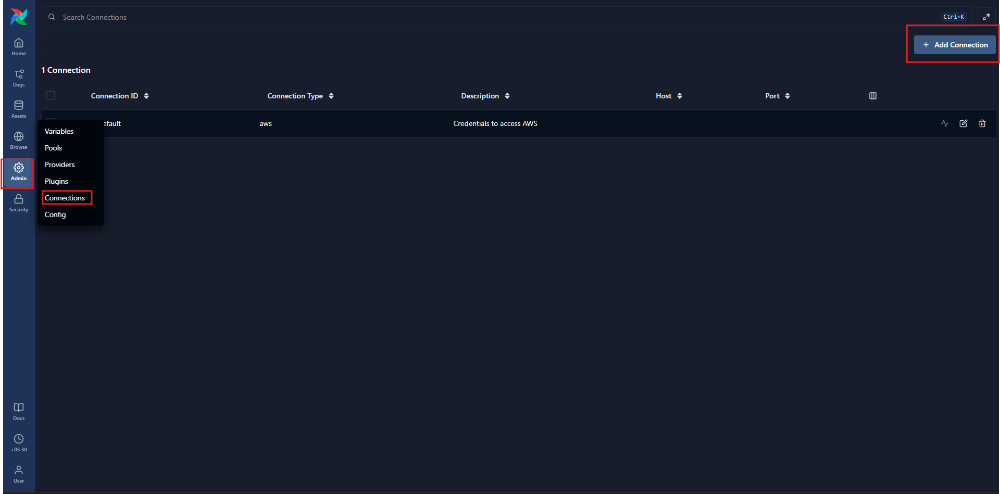
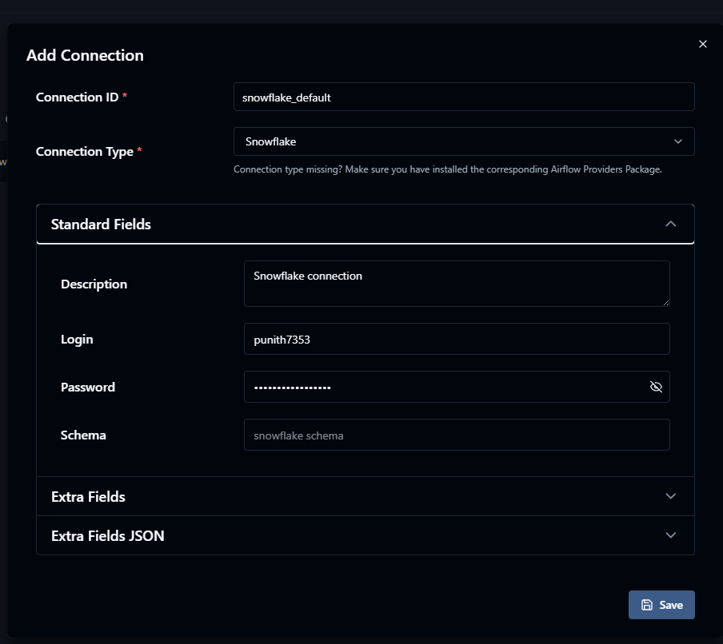
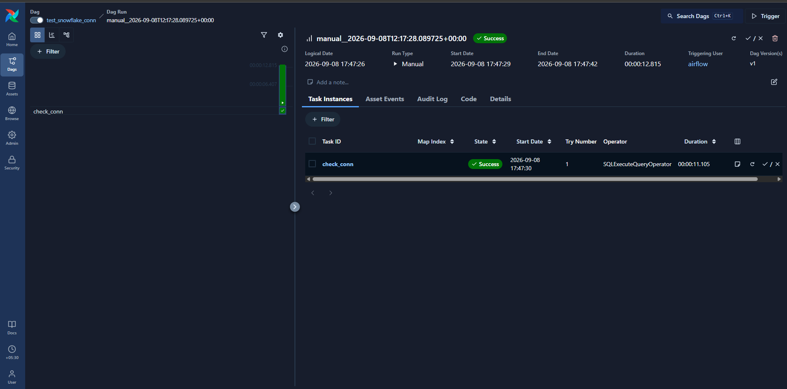

# ❄️ Snowflake & IAM Setup for Apache Airflow


> Configure a Snowflake connection in Apache Airflow and verify that Airflow can successfully connect to Snowflake.

---

## 🎯 Objective

This setup configures **Snowflake as a connection in Apache Airflow** and validates the connection using an Airflow DAG.

The configuration includes:

- ❄️ Snowflake connection
- 🔗 Airflow Connection ID
- 👤 Snowflake login
- 🔐 Snowflake password
- 🗂️ Snowflake schema
- 🧪 Connection verification DAG
- ✅ Successful Airflow task execution

---

# 1️⃣ Open Airflow Connections

Open the Apache Airflow UI and navigate to:

```text
Airflow
   │
   ▼
Admin
   │
   ▼
Connections
```

The **Connections** page displays the existing Airflow connections.

Click:

```text
+ Add Connection
```

### 📸 Airflow Connections



---

# 2️⃣ Add Snowflake Connection

In the **Add Connection** form, configure the Snowflake connection.

### Connection Configuration

| Field | Value |
|---|---|
| **Connection ID** | `snowflake_default` |
| **Connection Type** | `Snowflake` |
| **Description** | `Snowflake connection` |
| **Login** | Snowflake username |
| **Password** | Snowflake password |
| **Schema** | Snowflake schema |

The screenshot shows the following Connection ID:

```text
snowflake_default
```

The selected Connection Type is:

```text
Snowflake
```

The description is:

```text
Snowflake connection
```

### 📸 Configure Snowflake Connection



> 🔐 The password is masked in the Airflow interface and should be stored securely.

---

# 3️⃣ Save the Connection

After entering the required Snowflake connection details, click:

```text
Save
```

The connection is then available to Airflow DAGs using the configured Connection ID.

The connection identifier used by the DAG is:

```text
snowflake_default
```

---

# 4️⃣ Verify Snowflake Connection

The Snowflake connection is verified using the Airflow DAG:

```text
test_snowflake_conn
```

The DAG contains the task:

```text
check_conn
```

Trigger the DAG manually from the Airflow UI.

### Expected Result

The DAG run should complete successfully.

The screenshot shows:

```text
DAG: test_snowflake_conn

Task:
    check_conn

State:
    Success
```

### 📸 Successful Snowflake Connection Test



---

# 🔄 Connection Verification Flow

```text
Apache Airflow
      │
      ▼
Admin → Connections
      │
      ▼
snowflake_default
      │
      ├── Connection Type
      │       └── Snowflake
      │
      ├── Login
      │
      ├── Password
      │
      └── Schema
      │
      ▼
test_snowflake_conn
      │
      ▼
check_conn
      │
      ▼
      ✅ Success
```

---

# 🧩 Airflow Connection Configuration

The configured Airflow connection can be represented as:

```text
Connection ID
    │
    └── snowflake_default

Connection Type
    │
    └── Snowflake

Authentication
    │
    ├── Login
    └── Password

Database Configuration
    │
    └── Schema
```

---

# 📁 Related Source Files

| Resource | Link                                                                        |
|---|-----------------------------------------------------------------------------|
| 🧪 Snowflake Connection Test DAG | [`test_snowflake_conn.py`](../../airflow/dags/test_snowflake_connection.py) |

---

# 🛡️ Security Best Practices

- 🔐 Never commit Snowflake passwords to Git.
- 🚫 Do not hard-code credentials inside DAG files.
- 🔑 Store credentials using Airflow Connections or a secrets backend.
- 👤 Use a dedicated Snowflake user for Airflow where appropriate.
- 🎯 Grant only the permissions required by Airflow workloads.
- 🧹 Avoid exposing passwords or sensitive connection details in logs.
- 🔄 Rotate credentials according to your organization's security policy.

---