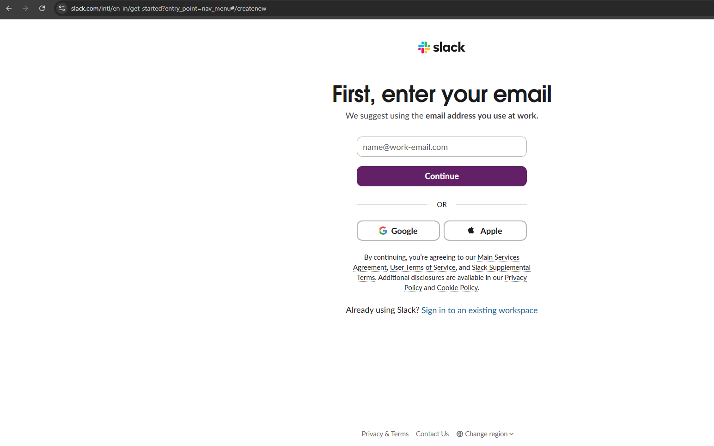
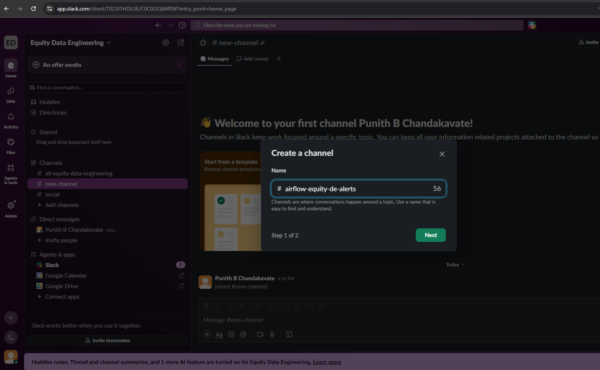
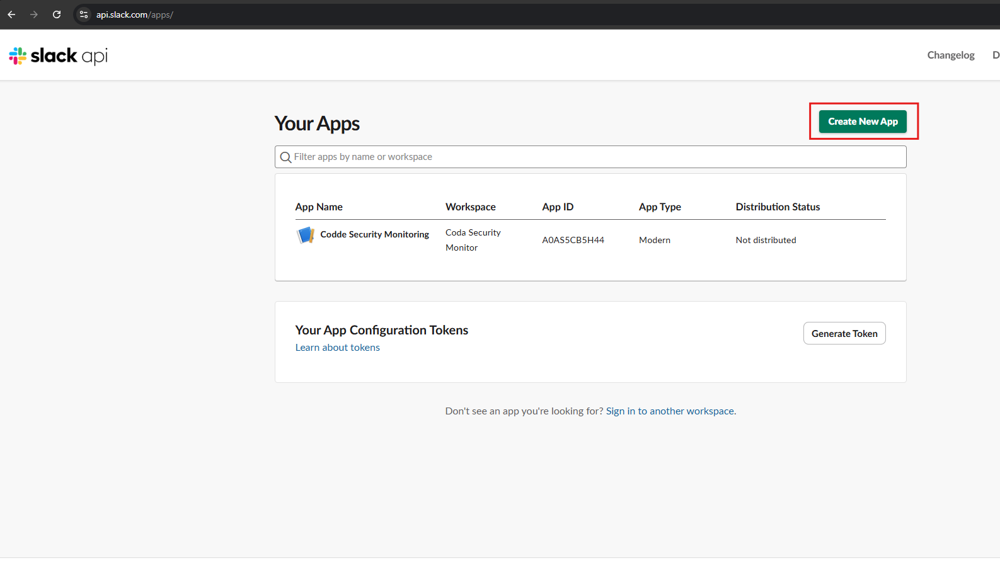
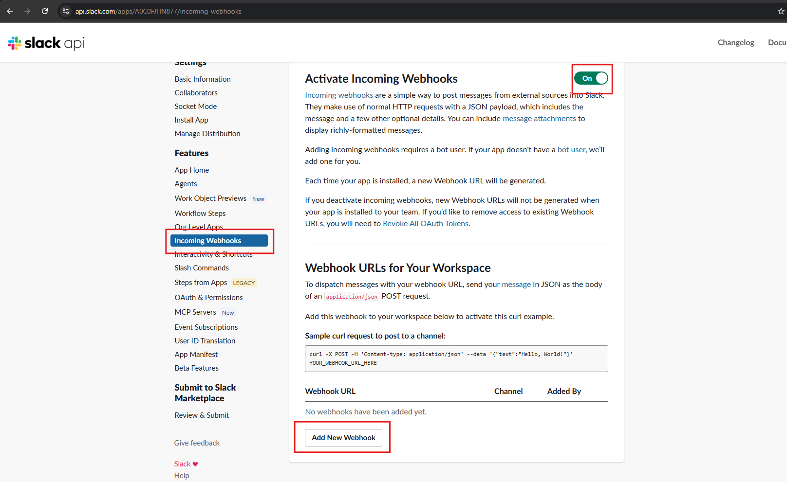
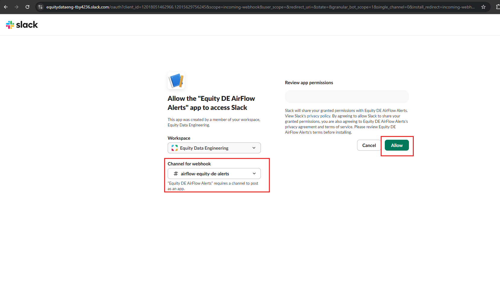
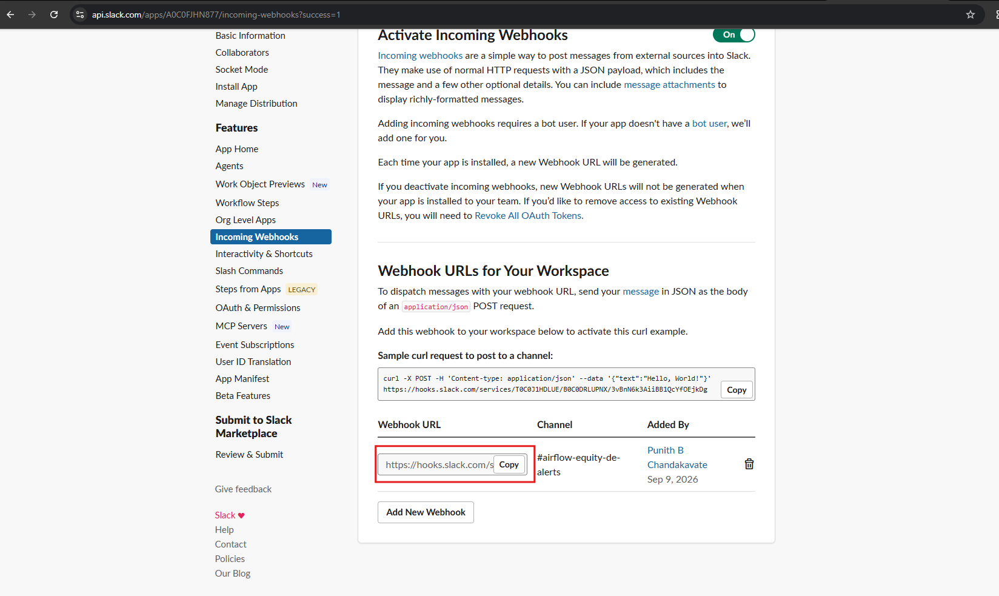
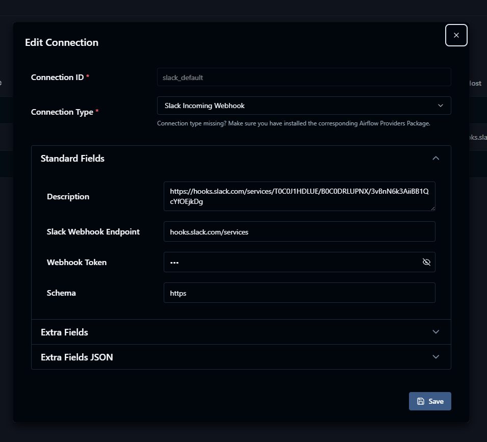
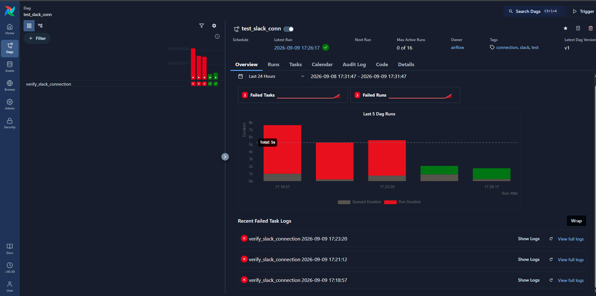
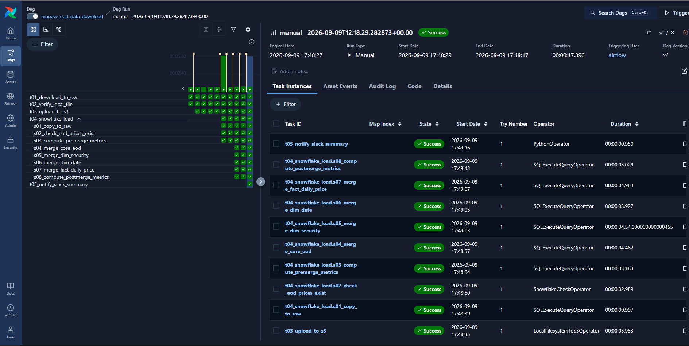
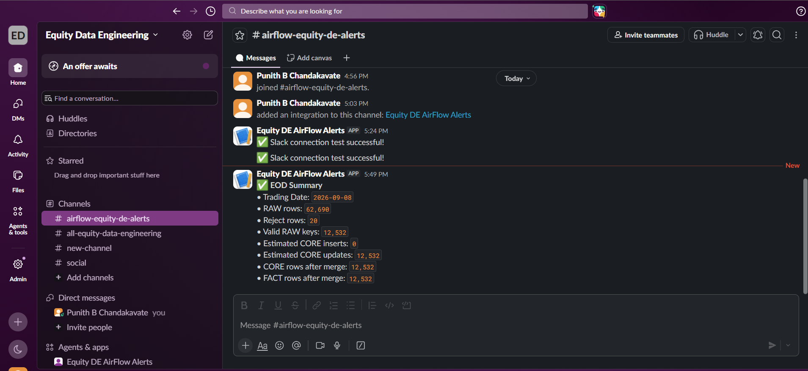

# 🔔 Slack Notifications with Apache Airflow


> Configure Slack Incoming Webhooks and integrate them with Apache Airflow to receive EOD pipeline notifications and execution summaries.

---

## 📑 Table of Contents

- 🎯 Overview
- 🏗️ Architecture
- 📋 Prerequisites
- 1️⃣ Register / Access Slack
- 2️⃣ Create a Slack Channel
- 3️⃣ Create a Slack App
- 4️⃣ Enable Incoming Webhooks
- 5️⃣ Add a Webhook
- 6️⃣ Select the Slack Channel
- 7️⃣ Copy the Webhook URL
- 8️⃣ Configure Airflow Slack Connection
- 9️⃣ Verify the Slack Connection
- 🔟 Run the EOD DAG
- 📨 Slack EOD Notification
- 🔐 Security Considerations
- 📁 Related Source Files
- 🎤 Interview Questions
- ✅ Validation Checklist

---

# 🎯 Overview

The EOD data pipeline uses **Slack Incoming Webhooks** to send execution notifications from Apache Airflow to a dedicated Slack channel.

The notification provides a compact summary of the EOD processing result, including:

- 📅 Trading date
- 📥 RAW row count
- 🚫 Reject row count
- 📊 Estimated CORE inserts
- 🔄 Estimated CORE updates
- 🗃️ CORE rows after merge
- 📈 FACT rows after merge

This allows the data engineering workflow to communicate pipeline results directly to the team.

---

# 🏗️ Architecture

```text
                    Apache Airflow
                          │
                          │
                          ▼
                 ┌─────────────────┐
                 │    EOD DAG      │
                 └────────┬────────┘
                          │
                          ▼
                 Snowflake Processing
                          │
                          │
                          ▼
                 Slack Summary Task
                          │
                          │ Webhook
                          ▼
                 ┌─────────────────┐
                 │      Slack      │
                 │                 │
                 │ #airflow-       │
                 │ equity-de-alerts│
                 └─────────────────┘
````

---

# 📋 Prerequisites

Before configuring Slack notifications, make sure you have:

* ✅ A Slack account
* ✅ Access to a Slack workspace
* ✅ Apache Airflow running
* ✅ Airflow web UI accessible
* ✅ EOD Airflow DAG configured
* ✅ Permission to create a Slack app
* ✅ Permission to create/use a Slack channel

---

# 1️⃣ Register / Access Slack

Open Slack and sign in or create a Slack workspace.

For this project, the Slack workspace used is:

```text
Equity Data Engineering
```

### 📸 Screenshot



---

# 2️⃣ Create a Slack Channel

Create a dedicated channel for Airflow pipeline alerts.

The channel used for this project is:

```text
#airflow-equity-de-alerts
```

A dedicated channel keeps pipeline notifications separate from general project communication.

### Steps

1. Open the Slack workspace.
2. Create a new channel.
3. Enter:

```text
airflow-equity-de-alerts
```

4. Create the channel.

### 📸 Screenshot



---

# 3️⃣ Create a Slack App

Go to the Slack API application page and create a new application.

Select:

```text
Create New App
```

Then choose:

```text
Create from scratch
```

Enter the application name:

```text
Equity DE AirFlow Alerts
```

Select the appropriate Slack workspace:

```text
Equity Data Engineering
```

### 📸 Screenshot



---

## 📝 App Configuration

The Slack application is used as the integration point between Airflow and Slack.

```text
Airflow
   │
   │ HTTP POST
   ▼
Slack Incoming Webhook
   │
   ▼
Slack Channel
```

---

# 4️⃣ Enable Incoming Webhooks

Open the Slack application configuration.

Navigate to:

```text
Features
    └── Incoming Webhooks
```

Enable:

```text
Activate Incoming Webhooks
```

The webhook feature should show:

```text
ON
```

Incoming Webhooks allow external applications such as Airflow to send messages to Slack using an HTTP endpoint.

### 📸 Screenshot



---

# 5️⃣ Add a Webhook

After enabling Incoming Webhooks, select:

```text
Add New Webhook
```

This starts the process of connecting the Slack application to a specific channel.

### 📸 Screenshot


---

# 6️⃣ Select the Slack Channel

Select the channel where Airflow notifications should be delivered.

For this project:

```text
#airflow-equity-de-alerts
```

Slack will ask for permission to allow the application to post messages to the selected channel.

Select:

```text
Allow
```

### 📸 Screenshot



---

# 7️⃣ Copy the Webhook URL

After the application is installed, Slack generates an Incoming Webhook URL.

The webhook URL has a structure similar to:

```text
https://hooks.slack.com/services/...
```

> ⚠️ **Never commit the complete webhook URL to GitHub.**

Copy the webhook URL and store it securely in the Airflow connection.

### 📸 Screenshot



---

# 8️⃣ Configure Airflow Slack Connection

Open the Airflow UI.

Navigate to:

```text
Admin
   └── Connections
```

Create or edit the Slack connection.

Use the following configuration:

| Field                  | Value                      |
| ---------------------- | -------------------------- |
| Connection ID          | `slack_default`            |
| Connection Type        | `Slack Incoming Webhook`   |
| Slack Webhook Endpoint | `hooks.slack.com/services` |
| Webhook Token          | `<SLACK_WEBHOOK_TOKEN>`    |
| Schema                 | `https`                    |

The webhook URL should **not** be stored directly in the DAG source code.

Instead, Airflow manages the webhook credentials through the connection:

```text
slack_default
```

### 📸 Screenshot



---

## 🔐 Webhook Configuration

Conceptually, the connection contains:

```text
slack_default
      │
      ├── Connection Type
      │      └── Slack Incoming Webhook
      │
      ├── Endpoint
      │      └── hooks.slack.com/services
      │
      ├── Webhook Token
      │      └── <stored securely>
      │
      └── Schema
             └── https
```

This keeps the webhook credential outside the DAG source code.

---

# 9️⃣ Verify the Slack Connection

After configuring the Airflow connection, run the Slack connection test DAG.

The DAG used for testing is:

```text
test_slack_conn
```

The DAG contains a task:

```text
verify_slack_connection
```

The purpose of this DAG is to verify that Airflow can successfully communicate with Slack using:

```text
slack_default
```

### 📸 Screenshot



---

## 🧪 Expected Result

After triggering the test DAG, the task should complete successfully.

The Slack channel should receive a test message similar to:

```text
✅ Slack connection test successful!
```

This confirms the connection between:

```text
Airflow
   │
   ▼
slack_default
   │
   ▼
Slack Webhook
   │
   ▼
#airflow-equity-de-alerts
```

---

# 🔟 Run the EOD DAG

Once the Slack connection has been verified, run the EOD data pipeline.

The EOD DAG performs the following workflow:

```text
Download EOD Data
        │
        ▼
Verify Local File
        │
        ▼
Upload to S3
        │
        ▼
Snowflake Load
        │
        ├── Copy to RAW
        ├── Check Loaded Data
        ├── Pre-Merge Metrics
        ├── CORE Merge
        ├── Security Dimension
        ├── Date Dimension
        ├── Daily Price Fact
        └── Post-Merge Metrics
        │
        ▼
Slack Summary
```

The final Airflow task is responsible for sending the EOD summary:

```text
t05_notify_slack_summary
```

### 📸 Screenshot



---

# 📨 Slack EOD Notification

After the EOD DAG completes, the pipeline sends a summary message to:

```text
#airflow-equity-de-alerts
```

The notification contains the EOD processing metrics.

Example:

```text
✅ EOD Summary

• Trading Date: 2026-09-08
• RAW rows: 62,690
• Reject rows: 20
• Valid RAW keys: 12,532
• Estimated CORE inserts: 0
• Estimated CORE updates: 12,532
• CORE rows after merge: 12,532
• FACT rows after merge: 12,532
```

### 📸 Screenshot



---

# 📊 EOD Notification Flow

```text
                    EOD DAG
                       │
                       ▼
              Snowflake Processing
                       │
                       ▼
             Pre/Post Merge Metrics
                       │
                       ▼
          t05_notify_slack_summary
                       │
                       ▼
                slack_default
                       │
                       ▼
             Incoming Webhook
                       │
                       ▼
          #airflow-equity-de-alerts
                       │
                       ▼
                 📊 EOD Summary
```

---

# 🔐 Security Considerations

The Slack Webhook URL is a sensitive credential.

### ❌ Do NOT

Store the webhook URL directly in:

```python
slack_webhook = "https://hooks.slack.com/services/..."
```

Do not commit the webhook URL to:

* GitHub
* README files
* DAG source code
* `.env` files committed to Git
* Screenshots containing the complete token

### ✅ Instead

Store the credential in the Airflow connection:

```text
Connection ID:
slack_default
```

The DAG references the Airflow connection rather than exposing the secret.

---

# 📁 Related Source Files

| Resource           | Link                                                                  |
| ------------------ | --------------------------------------------------------------------- |
| 🔔 Slack Test DAG  | [`test_slack_connection.py`](../../airflow/dags/test_slack_connection.py)         |
| ⚙️ EOD Airflow DAG | [`daily_eod_ingestion_dag.py`](../../airflow/dags/daily_eod_ingestion_dag.py) |
| 📨 Slack Utilities | [`slack_utils.py`](../../airflow/dags/lib/slack_utils.py)             |

---

# 🎤 Interview Questions

### 1. What is a Slack Incoming Webhook?

A Slack Incoming Webhook is an HTTP endpoint that allows an external application to send messages to a Slack channel.

---

### 2. Why use Slack notifications in Airflow?

Slack notifications provide real-time visibility into pipeline execution.

Data engineers can receive:

* Pipeline success notifications
* Failure alerts
* Data-quality metrics
* EOD processing summaries

without continuously monitoring the Airflow UI.

---

### 3. Why create a separate Slack channel for Airflow alerts?

A dedicated channel keeps pipeline alerts organized and prevents operational notifications from being mixed with general project communication.

---

### 4. Why should the webhook URL not be hardcoded?

The webhook URL is a credential. Hardcoding it can expose the credential through source code or Git history.

Airflow Connections provide a safer way to manage it.

---

### 5. What is `slack_default`?

`slack_default` is the Airflow Connection ID used by the DAG to reference the configured Slack Incoming Webhook connection.

---

### 6. What happens when the EOD DAG completes?

The final Slack summary task collects the EOD processing metrics and sends a summary message to the configured Slack channel.

---

### 7. What information is included in the EOD summary?

The summary includes metrics such as:

* Trading date
* RAW rows
* Reject rows
* Estimated CORE inserts
* Estimated CORE updates
* CORE rows after merge
* FACT rows after merge

---