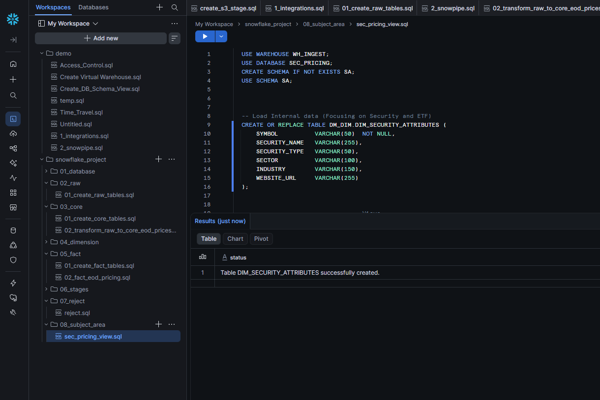
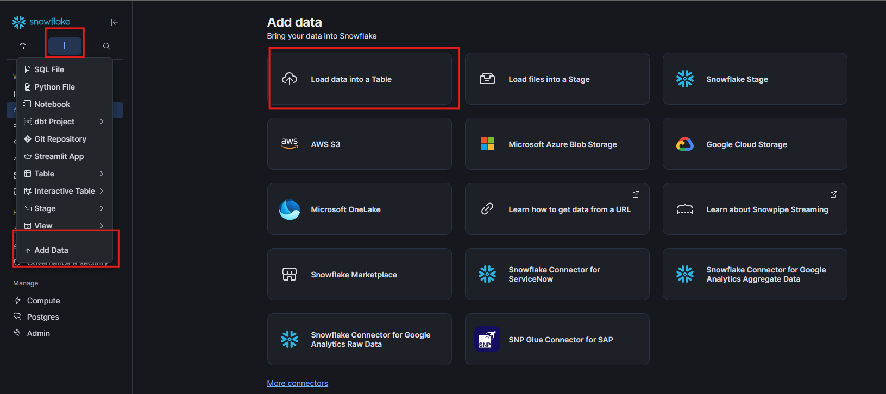
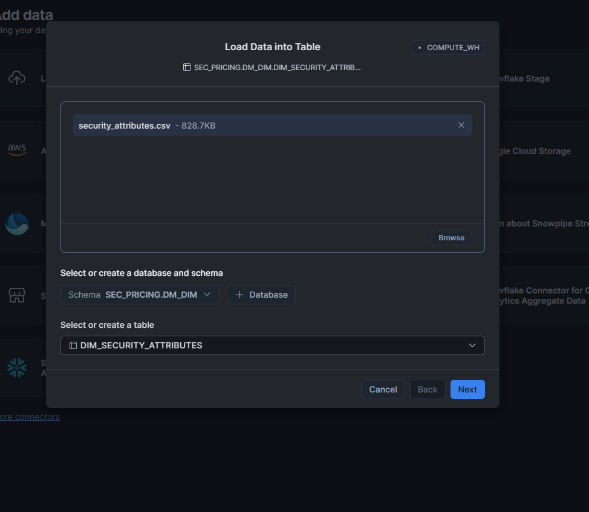
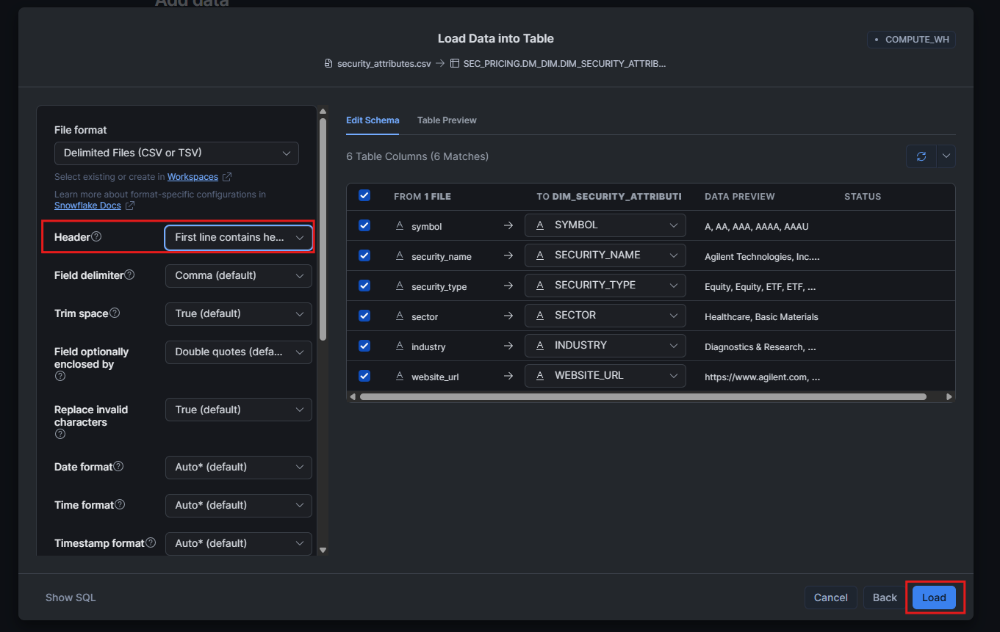
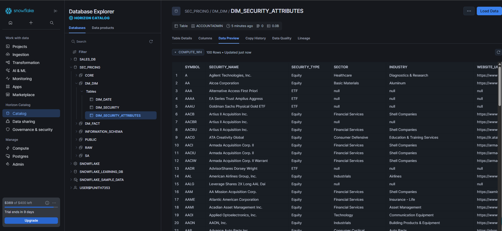

# 📊 Subject Area Layer — Power BI Analytics


The **Subject Area (SA) layer** is the analytical presentation layer of the
Snowflake securities pricing platform.

It transforms curated **DIMENSION** and **FACT** data into business-focused
datasets that can be consumed directly by **Power BI** for reporting,
visualization, and securities-market analysis.

---

## 🎯 Purpose

The Subject Area layer provides simplified and analysis-ready datasets for
business users and BI tools.

Instead of exposing the underlying RAW, CORE, DIMENSION, and FACT structures
directly to Power BI, the SA layer organizes the data around common analytical
requirements such as:

- 📈 Security daily pricing
- 🏆 Top equity volume
- 👀 Watchlist performance
- 📊 Security returns
- 🏭 Sector liquidity
- 📦 ETF liquidity
- 🏷️ Security attributes

The objective is to provide **clean, business-oriented datasets** that are
easy to understand and consume from Power BI.

---

# 🏗️ Data Architecture

The SA layer sits above the curated Snowflake data layers.

```text
                    Massive API
                         │
                         ▼
                    Airflow ETL
                         │
                         ▼ 
                    Amazon S3
                         │
                         ▼
                 Snowflake RAW Layer
                         │
                         ▼
                 Snowflake CORE Layer
                         │
                         ▼
              ┌──────────────────────┐
              │   DIMENSION / FACT   │
              │        Layers        │
              └──────────┬───────────┘
                         │
                         ▼
                 Subject Area (SA)
                         │
          ┌──────────────┼──────────────┐
          │              │              │
          ▼              ▼              ▼
     Security       Liquidity       Performance
      Analysis       Analysis         Analysis
          │              │              │
          └──────────────┼──────────────┘
                         │
                         ▼
                      Power BI
                         │
                         ▼
              Business Dashboards
````

---

# 1️⃣ Security Attributes

The first Subject Area dataset creates the
`DIM_SECURITY_ATTRIBUTES` table.

The table contains descriptive information about securities such as:

* Symbol
* Security name
* Security type
* Sector
* Industry
* Website URL

Example structure:

```text
DIM_SECURITY_ATTRIBUTES
│
├── SYMBOL
├── SECURITY_NAME
├── SECURITY_TYPE
├── SECTOR
├── INDUSTRY
└── WEBSITE_URL
```

The table is created in the:

```text
SEC_PRICING.DM_DIM
```

schema.

The screenshot below shows the table creation and successful execution in
Snowflake.



---

# 2️⃣ Load Security Attributes

The security attributes dataset is loaded from:

```text
security_attributes.csv
```

The Snowflake **Add Data → Load data into Table** workflow is used to load the
CSV data into:

```text
SEC_PRICING.DM_DIM.DIM_SECURITY_ATTRIBUTES
```



---

## 📥 Select Target Table

During the load process, select:

```text
Database : SEC_PRICING
Schema   : DM_DIM
Table    : DIM_SECURITY_ATTRIBUTES
```



---

## ⚙️ Configure CSV Format

The CSV is configured as a delimited file with:

```text
File Format  : CSV
Header       : First line contains headers
Delimiter    : Comma
Trim Space   : True
```

The columns are mapped to the corresponding table columns.



---

## 🔍 Data Preview

Before loading the file, Snowflake provides a preview of the incoming data
and its column mappings.

The preview confirms fields such as:

```text
symbol
security_name
security_type
sector
industry
website_url
```



---

# 📊 Security Attribute Data

After the load completes, the data can be viewed directly from the
Snowflake table.

Example records include securities such as:

```text
SYMBOL   SECURITY_NAME                  SECURITY_TYPE
-----------------------------------------------------
A        Agilent Technologies, Inc.     Equity
AA       Alcoa Corporation              Equity
AAA      Alternative Access First       ETF 
AAAA     EA Series Trust                ETF
AACB     Artius II Acquisition          Equity
```

The Snowflake Data Preview confirms that the
`DIM_SECURITY_ATTRIBUTES` table contains the loaded security metadata.

---

# 📈 Analytical Datasets

The remaining Subject Area SQL files create business-focused analytical
datasets.

## 📊 Security Daily Prices

[`02_security_daily_prices.sql`](02_security_daily_prices.sql)

Provides daily pricing information for securities and supports analysis such
as:

* Daily price trends
* Trading activity
* Security-level performance
* Historical price analysis

---

## 🏆 Top 20 Equity Volume

[`03_top20_equity_volume.sql`](03_top20_equity_volume.sql)

Provides an analytical dataset for identifying the highest-volume equity
securities.

Potential Power BI analysis includes:

* Top traded equities
* Volume ranking
* Daily volume comparison
* High-liquidity securities

---

## 👀 Watchlist History

[`04_watchlist_history.sql`](04_watchlist_history.sql)

Provides historical information for securities included in the watchlist.

This dataset can support:

* Watchlist monitoring
* Historical price analysis
* Watchlist performance
* Security-level trend analysis

---

## 📈 Security 30-Day Return

[`05_security_30d_return.sql`](05_security_30d_return.sql)

Provides security-level 30-day return information.

This supports analysis such as:

* 30-day performance
* Positive vs negative returns
* Security performance ranking
* Return comparisons

---

## 🏭 Sector Liquidity — Latest

[`06_sector_liquidity_latest.sql`](06_sector_liquidity_latest.sql)

Provides the latest sector-level liquidity information.

Power BI can use this dataset for:

* Sector liquidity comparison
* Liquidity ranking
* Sector-level market analysis
* Identification of highly liquid sectors

---

## 📦 ETF Liquidity — 30 Day

[`07_etf_liquidity_30d.sql`](07_etf_liquidity_30d.sql)

Provides 30-day liquidity information for ETFs.

This supports:

* ETF liquidity comparison
* ETF ranking
* 30-day trading analysis
* Liquidity trend analysis

---

# 🔗 Subject Area Relationships

The Subject Area datasets are derived from the curated Snowflake layers.

```text
                 SEC_PRICING
                      │
          ┌───────────┴───────────┐
          │                       │
          ▼                       ▼
        CORE                    DM_DIM
          │                       │
          │              ┌────────┴────────┐
          │              ▼                 ▼
          │        DIM_SECURITY        DIM_DATE
          │
          ▼
       DM_FACT
          │
          ▼
   FACT_DAILY_PRICE
          │
          └──────────────┐
                         │
                         ▼
                Subject Area (SA)
                         │
       ┌─────────────────┼─────────────────┐
       │                 │                 │
       ▼                 ▼                 ▼
 Security Analysis   Liquidity       Performance
                     Analysis          Analysis
       │                 │                 │
       └─────────────────┼─────────────────┘
                         ▼
                      Power BI
```

---

# 🧩 Power BI Usage

The Subject Area layer is designed to act as the **consumption layer for
Power BI**.

Power BI can connect to Snowflake and use the SA datasets as the source for
analytical reports.

```text
Snowflake
    │
    ▼
Subject Area Tables
    │
    ▼
Power BI
    │
    ├── Security Dashboard
    ├── Liquidity Dashboard
    ├── Performance Dashboard
    ├── Watchlist Dashboard
    └── ETF Analysis
```

This approach keeps Power BI focused on **visualization and business
analysis**, while Snowflake handles the underlying data preparation and
analytical SQL.

---

# 📊 Power BI Analysis Areas

The SA datasets can support dashboards such as:

| Dashboard               | Primary Dataset         | Example Analysis        |
| ----------------------- | ----------------------- | ----------------------- |
| 📈 Security Performance | Security 30D Return     | 30-day returns          |
| 🏆 Trading Activity     | Top 20 Equity Volume    | Highest-volume equities |
| 👀 Watchlist            | Watchlist History       | Watchlist trends        |
| 🏭 Sector Liquidity     | Sector Liquidity Latest | Sector comparison       |
| 📦 ETF Analysis         | ETF Liquidity 30D       | ETF liquidity           |
| 📊 Daily Pricing        | Security Daily Prices   | Daily price trends      |
| 🏷️ Security Overview   | Security Attributes     | Security metadata       |

---

# 🎯 Benefits of the SA Layer

### 🧹 Simplified Data Consumption

Power BI users do not need to understand the complete RAW → CORE → DIM → FACT
data model.

### 📊 Business-Oriented Datasets

Each SA dataset is designed around a specific analytical requirement.

### ⚡ Faster BI Development

Power BI reports can consume prepared analytical datasets instead of
implementing complex transformations inside the BI layer.

### 🔄 Centralized SQL Logic

Analytical logic is maintained in Snowflake rather than duplicated across
multiple Power BI reports.

### 🛡️ Controlled Data Exposure

Only the required analytical datasets need to be exposed to downstream
consumers.

---

# 📁 Related SQL Files

| File                                                                                                     | Description                                |
|----------------------------------------------------------------------------------------------------------|--------------------------------------------|
| [`security_attributes.csv`](../../datasets/security_attributes.csv)                                      | SECURITY ATTRIBUTES                        |
| [`01_create_security_attributes.sql`](../../snowflake/08_subject_area/01_create_security_attributes.sql) | Create and prepare security attribute data |
| [`02_security_daily_prices.sql`](../../snowflake/08_subject_area/02_security_daily_prices.sql)           | Security daily pricing analysis            |
| [`03_top20_equity_volume.sql`](../../snowflake/08_subject_area/03_top20_equity_volume.sql)               | Top 20 equity volume analysis              |
| [`04_watchlist_history.sql`](../../snowflake/08_subject_area/04_watchlist_history.sql)                   | Watchlist historical analysis              |
| [`05_security_30d_return.sql`](../../snowflake/08_subject_area/05_security_30d_return.sql)               | 30-day security return analysis            |
| [`06_sector_liquidity_latest.sql`](../../snowflake/08_subject_area/06_sector_liquidity_latest.sql)       | Latest sector liquidity analysis           |
| [`07_etf_liquidity_30d.sql`](../../snowflake/08_subject_area/07_etf_liquidity_30d.sql)                   | 30-day ETF liquidity analysis              |
| [`08_validate_sa_views.sql`](../../snowflake/08_subject_area/08_validate_sa_views.sql)                   | Validate SA Views                          |

---

# 🎉 Final Result

The **Subject Area layer** provides a clean analytical interface between
Snowflake and Power BI.

```text
          Snowflake Data Platform
                   │
                   ▼
          Curated DIM + FACT
                   │
                   ▼
           Subject Area Layer
                   │
        ┌──────────┼──────────┐
        ▼          ▼          ▼
     Security   Liquidity   Returns
     Analysis   Analysis    Analysis
        │          │          │
        └──────────┼──────────┘
                   ▼
                Power BI
                   │
                   ▼
          Business Insights
```

The result is a **business-ready analytical layer** that allows Power BI to
consume curated securities pricing, liquidity, watchlist, return, and ETF
datasets for reporting and decision-making.
