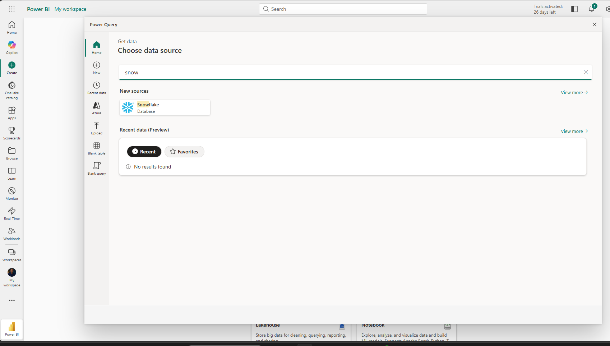
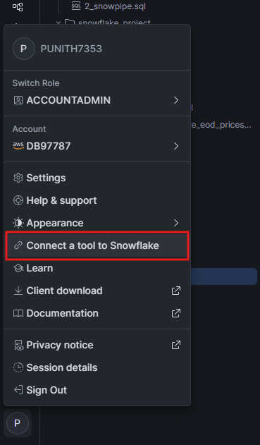
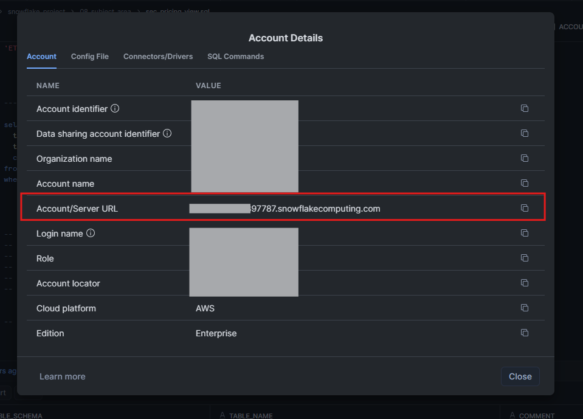
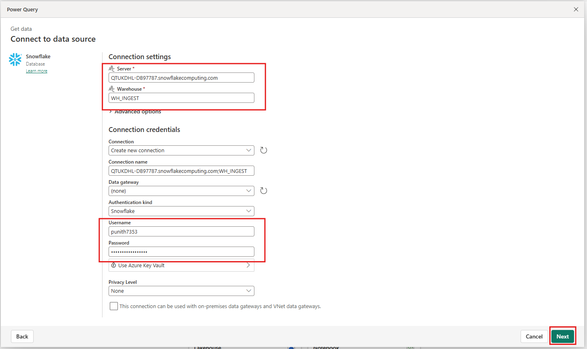
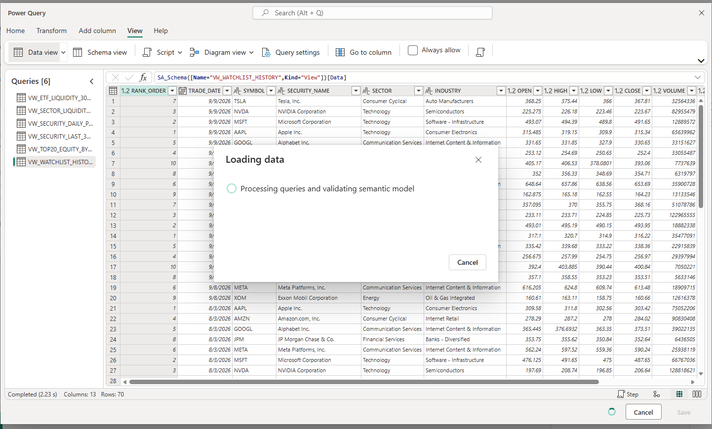
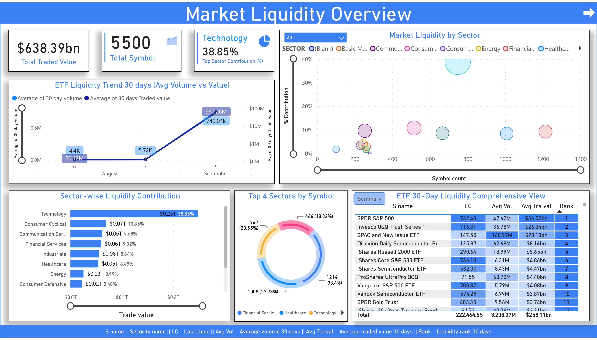
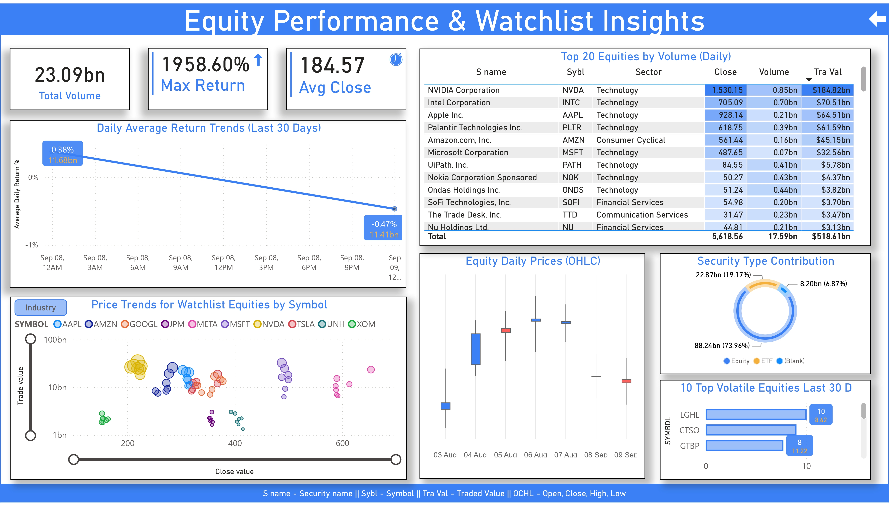

# 📊 Connect Power BI to Snowflake


This guide documents how to connect **Microsoft Power BI** to the
**Snowflake Subject Area (SA) layer** and import analytical datasets for
business intelligence and dashboard development.

The connection allows Power BI to consume curated Snowflake data prepared
for securities pricing, liquidity, performance, and watchlist analysis.

---

## 🎯 Objective

The objective is to establish the following connection:

```text
                    Snowflake
                       │
                       ▼
              SEC_PRICING Database
                       │
                       ▼
                Subject Area (SA)
                       │
          ┌────────────┼────────────┐
          ▼            ▼            ▼
       Security      Liquidity    Performance
       Analysis      Analysis      Analysis
          │            │            │
          └────────────┼────────────┘
                       │
                       ▼
                  Power BI
                       │
                       ▼
              Business Dashboards
````

Power BI is used as the **visualization and business analysis layer**, while
Snowflake remains responsible for the underlying data storage and SQL
analytics.

---

# 🏗️ Architecture

```text
Massive API
     │
     ▼
Apache Airflow
     │
     ▼
Amazon S3
     │
     ▼
Snowflake RAW
     │
     ▼
Snowflake CORE
     │
     ▼
DIMENSION + FACT
     │
     ▼
SUBJECT AREA
     │
     │  Snowflake Connector
     ▼
Power BI Power Query
     │
     ▼
Power BI Semantic Model
     │
     ▼
Dashboards & Reports
```

---

# 📋 Prerequisites

Before starting the Power BI connection, make sure:

* ✅ Snowflake account is available
* ✅ Snowflake Subject Area datasets are created
* ✅ Required Snowflake user credentials are available
* ✅ Required Snowflake role has access to the analytical objects
* ✅ Snowflake warehouse is available
* ✅ Power BI Desktop is installed
* ✅ Snowflake server/account URL is available

---

# 1️⃣ Open Power BI Get Data

Open **Power BI** and start the process of connecting to a data source.

Navigate to:

```text
Home
  │
  ▼
Get Data
  │
  ▼
Search: Snowflake
```

Select:

```text
Snowflake
Database
```



The Snowflake connector is used to establish the connection between
Power BI and the Snowflake account.

---

# 2️⃣ Get Snowflake Server Information

The Snowflake server URL can be obtained from the Snowflake interface.

In Snowflake:

```text
Profile
   │
   ▼
Connect a tool to Snowflake
   │
   ▼
Account Details
```

The **Account / Server URL** contains the server information required by the
Power BI Snowflake connector.



---

# 3️⃣ Copy Snowflake Server URL

Copy the **Account / Server URL** from Snowflake.

Example format:

```text
<account_identifier>.snowflakecomputing.com
```

Do not expose usernames, passwords, account identifiers, or other sensitive
credentials in source code or documentation.



---

# 4️⃣ Configure Power BI Snowflake Connection

Return to Power BI and enter the Snowflake connection details.

The connection configuration contains:

```text
Server
Warehouse
Authentication
Username
Password
```

Example:

```text
Server:
<account_identifier>.snowflakecomputing.com

Warehouse:
WH_INGEST

Authentication:
Snowflake

Username:
<your_username>

Password:
<your_password>
```

> 🔐 Never commit Snowflake usernames, passwords, tokens, or other
> credentials to GitHub.



---

# 5️⃣ Connect to Snowflake

After entering the connection details, select:

```text
Next
```

Power BI establishes the connection with Snowflake using the configured
server, warehouse, and authentication details.

Once authentication succeeds, Power BI can browse the available Snowflake
databases, schemas, tables, and views that the connected user is authorized
to access.

---

# 6️⃣ Select Subject Area Data

The Power BI connection is intended to consume the analytical datasets from
the Snowflake Subject Area layer.

The Subject Area contains business-oriented datasets for:

```text
Security Pricing
       │
       ├── Daily Prices
       │
       ├── Top Equity Volume
       │
       ├── Watchlist History
       │
       ├── Security Returns
       │
       ├── Sector Liquidity
       │
       └── ETF Liquidity
```

In Power BI, select the required analytical views/tables and load them into
Power Query.

---

# 7️⃣ Import Data into Power BI

After selecting the required Snowflake objects, Power BI loads the data into
Power Query.

The Power Query window can be used to review the imported datasets before
they are loaded into the Power BI semantic model.

The project uses multiple Subject Area analytical views for:

* 📈 Security daily pricing
* 🏆 Top equity volume
* 👀 Watchlist history
* 📊 Security performance
* 🏭 Sector liquidity
* 📦 ETF liquidity



---

# 🔍 Power Query Validation

Before creating dashboards, validate the imported datasets.

Check:

* Column names
* Data types
* Date fields
* Security symbols
* Price values
* Volume values
* Traded value
* Return calculations
* Sector information
* ETF information

Example Power Query data includes fields such as:

```text
RANK_ORDER
TRADE_DATE
SYMBOL
SECURITY_NAME
SECTOR
INDUSTRY
OPEN
HIGH
LOW
CLOSE
VOLUME
TRADED_VALUE
```

The exact columns depend on the selected Subject Area dataset.

---

# 📊 Power BI Semantic Model

After validating the data in Power Query, load the required datasets into the
Power BI semantic model.

```text
Snowflake SA Views
        │
        ▼
Power Query
        │
        ├── Data Validation
        ├── Data Types
        └── Transformation
        │
        ▼
Power BI Semantic Model
        │
        ▼
Measures / Visuals
        │
        ▼
Dashboards
```

---

# 📈 Dashboard 1 — Market Liquidity Overview

The first dashboard provides a market-wide liquidity overview.

It contains analytical components such as:

* 💰 Total Traded Value
* 🔢 Total Symbols
* 🏭 Top Sector Contribution
* 📈 ETF 30-Day Liquidity Trend
* 🏭 Market Liquidity by Sector
* 📊 Sector-wise Liquidity Contribution
* 🏆 Top Sectors by Symbol
* 📋 ETF 30-Day Liquidity Ranking



This dashboard provides a high-level view of market liquidity and helps
compare liquidity across sectors and ETFs.

---

# 📈 Dashboard 2 — Equity Performance & Watchlist

The second dashboard focuses on equity performance and watchlist analysis.

It includes:

* 📊 Total Volume
* 📈 Maximum Return
* 💹 Average Close
* 📉 Daily Average Return Trends
* 🏆 Top 20 Equities by Volume
* 👀 Watchlist Price Trends
* 🕯️ Equity Daily Prices
* 📊 Security Type Contribution
* ⚡ Top Volatile Equities



This dashboard allows users to analyze individual securities, trading
activity, price movements, returns, and watchlist performance.

---

# 🔄 End-to-End Power BI Flow

```text
                   Snowflake
                       │
                       ▼
              SEC_PRICING Database
                       │
                       ▼
                Subject Area
                       │
          ┌────────────┼────────────┐
          ▼            ▼            ▼
       Pricing      Liquidity     Returns
          │            │            │
          └────────────┼────────────┘
                       │
                       ▼
                Snowflake Connector
                       │
                       ▼
                  Power Query
                       │
                       ▼
              Semantic Model
                       │
                       ▼
                 Power BI Report
                       │
             ┌─────────┴─────────┐
             ▼                   ▼
       Market Liquidity      Equity Performance
          Dashboard              Dashboard
```

---

# 📊 Analysis Areas

| Analysis Area       | Business Question                                              |
| ------------------- | -------------------------------------------------------------- |
| 💰 Traded Value     | How much value is being traded?                                |
| 🏭 Sector Liquidity | Which sectors contribute most to liquidity?                    |
| 🏆 Equity Volume    | Which equities have the highest trading volume?                |
| 📈 Returns          | Which securities have performed best over the selected period? |
| 👀 Watchlist        | How are selected securities trending?                          |
| 📦 ETF Liquidity    | Which ETFs have the highest liquidity?                         |
| ⚡ Volatility        | Which equities show significant price movement?                |

---

